# SPI TWamp — распределённая система зондирования сети

[](https://github.com/akprof2000/twamp-probe/actions/workflows/build.yml)

Система измерения качества сети (задержки, потери, джиттер) по протоколу **TWAMP** и обычному **ICMP-ping**. Центральный сервер раздаёт задачи зондирования распределённым пробам, собирает результаты, разбирает их в статистику и отдаёт отчёты в CSV.

Рассчитана на масштаб **~10 000 одновременных задач** на пробу.

## Зачем это нужно (для тех, кто видит проект впервые)

Представьте: у вас сотни маршрутизаторов по всей стране, и нужно постоянно знать,
какая до каждого из них задержка, есть ли потери пакетов и джиттер. Вручную это не
сделать. SPI TWamp решает задачу так:

1. Рядом с «интересными» участками сети ставятся **пробы** — лёгкие агенты, которые умеют запускать измерительные утилиты.
2. В центре работает **сервер** — на нём оператор описывает, *что*, *как часто* и *откуда* измерять.
3. Сервер раздаёт задачи пробам, пробы гоняют зонды по расписанию, результаты стекаются обратно на сервер, где превращаются в статистику и CSV-отчёты.

### Глоссарий

| Термин | Что означает |
|---|---|
| **Проба** (probe) | агент `SPI.TWamp.Probe` на измерительной площадке; исполняет задачи |
| **Задача** | «зондируй узел X с расписанием Y и параметрами Z»; живёт в БД сервера |
| **Зонд** | одиночный запуск измерительной утилиты (`twping`, `twampy`, `ping`) |
| **Рефлектор** | TWAMP-ответчик на измеряемом узле, «отражает» пакеты обратно |
| **Шаблон** | заготовка задачи; накладывается на список маршрутизаторов при массовой заливке |
| **Результат** | сырой вывод одного зонда; разбирается сервером в статистику |
| **Сверка** (reconcile) | фоновое выравнивание списка задач между сервером и пробой |

---

## Содержание

- [Архитектура](#архитектура)
- [Как это работает: процессы на схемах](#как-это-работает-процессы-на-схемах)
- [Возможности](#возможности)
- [Быстрый старт](#быстрый-старт)
- [Конфигурация](#конфигурация)
- [Как работать с TWampy](#как-работать-с-twampy)
- [Проба на Go (экспериментальная)](#проба-на-go-экспериментальная)
- [Веб-интерфейс оператора](#веб-интерфейс-оператора)
- [Форматы файлов](#форматы-файлов)
- [HTTP API](#http-api)
- [Механизмы надёжности](#механизмы-надёжности)
- [Безопасность](#безопасность)
- [Производительность](#производительность)
- [Разработка](#разработка)
- [Обновление](#обновление)

---

## Архитектура

Система состоит из двух приложений (.NET 10, ASP.NET Core). Сервер один, проб — сколько угодно.

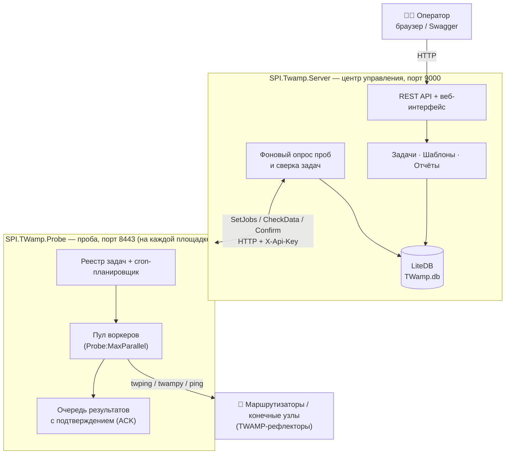

**Сервер** (`SPI.Twamp.Server`) — центр управления:

| Слой | Содержимое |
|---|---|
| `Contracts/` | модели данных (задачи, результаты, шаблоны, статистика) |
| `Abstractions/` | интерфейсы репозиториев и сервисов |
| `Infrastructure/` | LiteDB-репозитории, HTTP-клиент пробы (Flurl) |
| `Application/` | бизнес-логика: задачи, клиенты, отчёты, массовая заливка |
| `BackgroundServices/` | опрос проб, сверка задач, ретенция БД |
| `Controllers/` | тонкие REST-контроллеры: задачи, пробы/мониторинг, отчёты/заливка |
| `wwwroot/` | веб-интерфейс оператора (одна страница) |

**Проба** (`SPI.TWamp.Probe`) — исполнитель на площадке:

| Компонент | Назначение |
|---|---|
| `Worker` | реестр задач, инкрементальное слияние изменений |
| `ProbeDispatcher` | пул воркеров — ограниченная параллельность запуска зондов |
| `ProbeRunner` | асинхронный запуск процесса зонда, таймаут с принудительным завершением |
| `CronExecuter` | планирование по cron-выражению (NCrontab) |
| `ResultStore` | очередь результатов с подтверждением доставки (ACK) |

---

## Как это работает: процессы на схемах

### Жизненный цикл задачи — от создания до отчёта

Главный сквозной процесс системы: оператор описывает задачу, сервер доставляет её
пробе, проба измеряет по расписанию, результаты возвращаются и превращаются в отчёт.

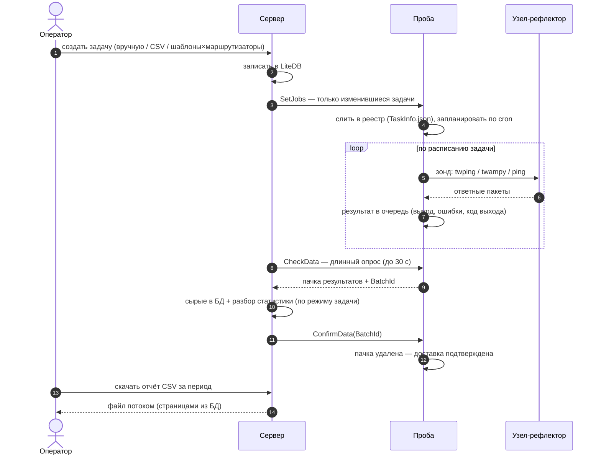

### Подключение новой пробы

Проба не требует настройки на своей стороне — её «знакомит» с сервером оператор.

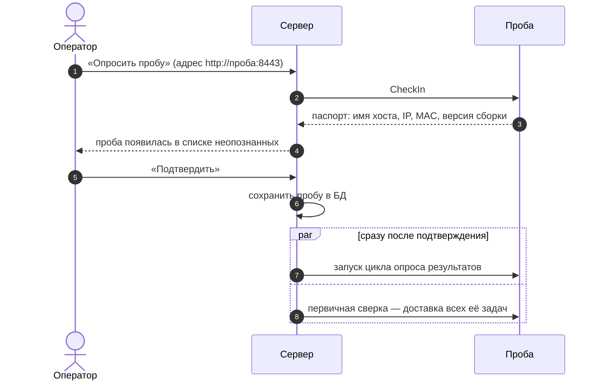

### Гарантированная доставка результатов («ровно один раз»)

Пачка не удаляется с пробы, пока сервер не подтвердит запись — сбой любой из сторон
не теряет и не задваивает данные.

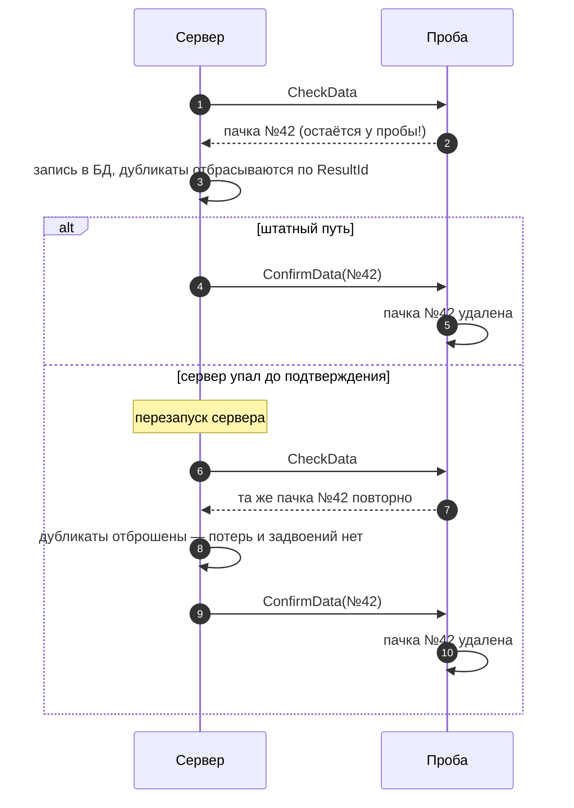

### Фоновая сверка задач (самовосстановление)

Каждые `Probe:ReconcileIntervalSec` (по умолчанию 30 с) сервер выравнивает список
задач каждой пробы со своей БД. Благодаря этому чистая переустановленная проба
конфигурируется сама, а устаревшие задачи не «зависают».

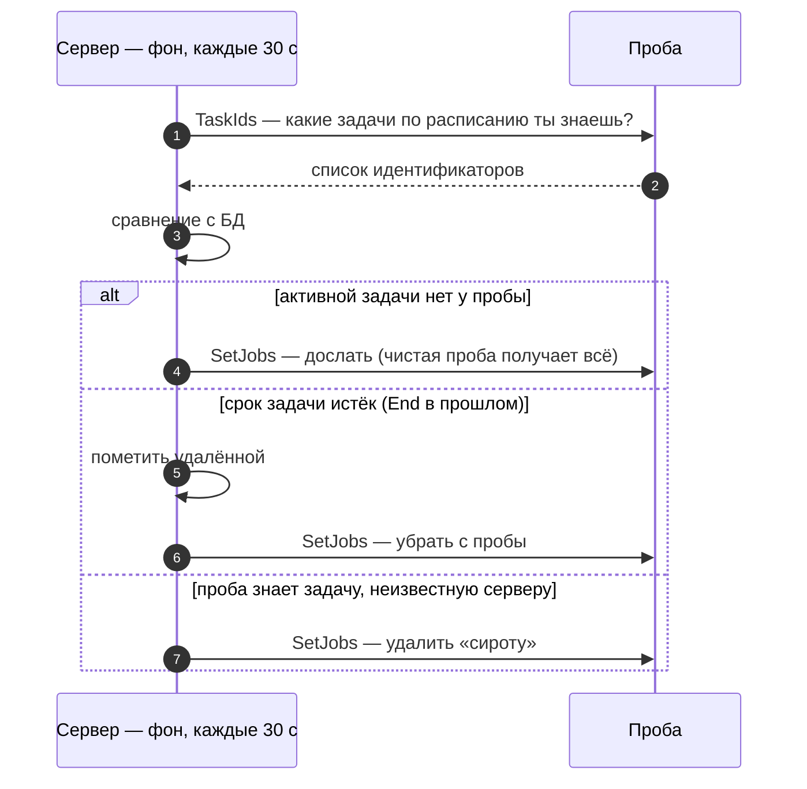

### Выполнение зонда на пробе: исходы запуска

Каждый запуск заканчивается одним из четырёх исходов — он виден в статусе задач
и попадает в отчёт (колонка `Errors` собирает stderr, таймаут и код выхода).

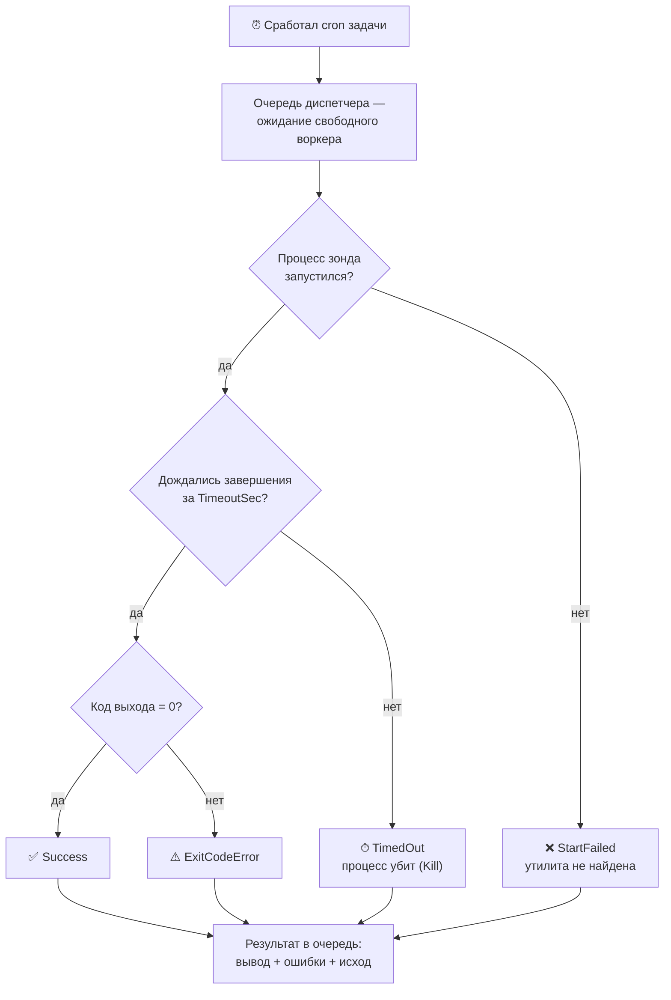

### Массовая заливка: шаблоны × маршрутизаторы

Тысячи задач создаются одним запросом: набор шаблонов накладывается на выгрузку
маршрутизаторов из системы инвентаризации.

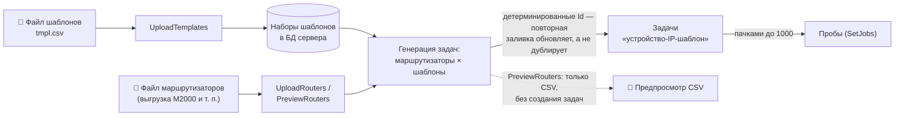

---

## Возможности

- **Три режима зондирования**: **TWamp** (`twping` от [perfsonar](https://github.com/perfsonar)), **TWampy** ([nokia/twampy](https://github.com/nokia/twampy), TWAMP-Light на Python — вендорен в проекте) и системный `ping`; параметры командной строки задаются на задачу. Режим фиксируется в каждом результате и показан во всех таблицах и в отчёте (колонка `Mode`). Данные twampy разбираются в те же поля, что и twping, — отчёты и графики одинаковы независимо от утилиты (см. [Как работать с TWampy](#как-работать-с-twampy)).
- **Расписание**: cron-выражения (с секундами при необходимости), период действия задачи, циклы/повторы/паузы.
- **Индивидуальный таймаут** каждого запуска зонда — процесс принудительно завершается (`Kill`), факт фиксируется в результате.
- **Массовая заливка**: файл шаблонов CSV × файл маршрутизаторов → тысячи задач одним запросом, с предпросмотром.
- **Самонастройка пробы**: чистая (переустановленная) проба автоматически получает все свои задачи от сервера.
- **Гарантированная доставка результатов**: пачки с подтверждением + дедупликация = «ровно один раз».
- **Отчёты CSV**: потоковая выгрузка любой глубины, колонка `CallLine` (фактическая команда) для однозначной идентификации ответа.
- **Мониторинг**: страница статуса проб — связь, ошибки, версия, число задач.
- **Полный цикл управления пробами**: регистрация → подтверждение → обновление данных → **удаление** (с остановкой опроса и, по желанию, задач пробы); неопознанную пробу можно **отклонить**.
- **Две реализации пробы**: основная на C#/.NET и лёгкая экспериментальная на Go — один статический бинарник ~6 МБ без зависимостей (см. [Проба на Go](#проба-на-go-экспериментальная)).
- **Ретенция**: автоматическая очистка старых данных, БД не растёт бесконечно.

---

## Быстрый старт

### Вариант 1: готовые релизы (рекомендуется)

На [странице релизов](https://github.com/akprof2000/twamp-probe/releases) лежат готовые
сборки для Linux x64 — самый быстрый способ попробовать систему:

```bash
# Сервер (самодостаточный — .NET на хосте не нужен)
tar -xzf twamp-server-*-selfcontained.tar.gz -C /opt/twamp-server
/opt/twamp-server/SPI.Twamp.Server

# Проба (на измерительной площадке)
tar -xzf twamp-probe-*-selfcontained.tar.gz -C /opt/twamp-probe
/opt/twamp-probe/SPI.TWamp.Probe
```

`*-framework.tar.gz` — те же приложения в 15 раз меньше, но на хосте нужен .NET 10 Runtime (ASP.NET Core).

### Вариант 2: сборка из исходников

#### Требования

- .NET 10 SDK (для сборки) или .NET 10 Runtime (для запуска).
- Для режима **TWamp** — утилита `twping` (perfsonar) рядом с пробой (для `ping` ничего не нужно).
- Для режима **TWampy** — Python 3.8+ на пробе; сам twampy вендорен в проекте (папка `SPI.TWamp.Probe/twampy/`, копируется в вывод сборки).
- Windows или Linux (проба поддерживает systemd).

#### Сборка

```bash
dotnet build SPI.TWamp.slnx -c Release
```

Публикация самодостаточного дистрибутива (пример для Linux — готовые скрипты `publish.cmd` лежат в папках проектов):

```bash
dotnet publish SPI.TWamp.Probe  -c Release -r linux-x64 --self-contained true
dotnet publish SPI.Twamp.Server -c Release -r linux-x64 --self-contained true
```

### Запуск

```bash
# Проба (на измерительной площадке), по умолчанию порт 8443
dotnet SPI.TWamp.Probe.dll

# Сервер (в центре), по умолчанию порт 9000
dotnet SPI.Twamp.Server.dll
```

Порты меняются ключом `Urls` в `appsettings.json` каждого приложения.

### Подключение пробы (3 шага)

Схема процесса — [выше](#подключение-новой-пробы). Кратко:

1. Откройте веб-интерфейс сервера: `http://сервер:9000/`.
2. На вкладке **«Статус проб»** введите адрес пробы (`http://адрес-пробы:8443`) и нажмите **«Опросить пробу»** — проба появится в списке неопознанных.
3. Нажмите **«Подтвердить»** — сервер запустит опрос результатов и синхронизацию задач.

После этого можно создавать задачи: проба получит их автоматически.

---

## Конфигурация

Все настройки — в `appsettings.json`; любую можно переопределить переменной окружения (двойное подчёркивание вместо двоеточия: `Auth__ApiKey`, `Probe__MaxParallel`).

### Сервер (`SPI.Twamp.Server/appsettings.json`)

| Ключ | По умолчанию | Назначение |
|---|---|---|
| `Urls` | `http://0.0.0.0:9000` | адрес и порт HTTP |
| `Database:Path` | `TWamp.db` | путь к файлу LiteDB |
| `Database:CheckpointMin` | `5` | период переноса WAL-журнала (`*-log.db`) в основную базу |
| `Auth:ApiKey` | *(пусто)* | общий ключ API; пусто — аутентификация выключена |
| `Probe:HttpTimeoutSec` | `60` | таймаут HTTP-запросов к пробам (включая длинный опрос) |
| `Probe:ReconcileIntervalSec` | `30` | период фоновой сверки задач с пробами |
| `Probe:CleanupWaitHours` | `24` | сколько **часов** после удаления пробы ждать её появления, чтобы снять с неё задания; по истечении — задачи пробы и кэш вычищаются |
| `Retention:IntervalMin` | `60` | период запуска очистки БД |
| `Retention:RawDays` | `14` | хранение сырых результатов, дней |
| `Retention:StatsDays` | `90` | хранение разобранной статистики, дней |
| `Retention:DeletedTaskDays` | `7` | через сколько дней окончательно вычищать удалённые задачи |

### Проба (`SPI.TWamp.Probe/appsettings.json`)

| Ключ | По умолчанию | Назначение |
|---|---|---|
| `Urls` | `http://0.0.0.0:8443` | адрес и порт HTTP |
| `Auth:ApiKey` | *(пусто)* | тот же ключ, что на сервере |
| `Probe:MaxParallel` | `1024` | **сколько процессов зонда работает одновременно** (пул воркеров) |
| `Probe:MaxPendingResults` | `100000` | лимит очереди результатов при недоступности сервера (старые вытесняются) |
| `Probe:PersistIntervalSec` | `5` | период сохранения очереди недоставленных результатов на диск (больше — меньше дисковая нагрузка; при аварии теряется максимум этот интервал; при штатной остановке — финальный снимок) |
| `Probe:ServerTimeoutHours` | `24` | сторож связи: если сервер не обращался к пробе дольше этого числа **часов**, проба считает себя удалённой — останавливает все задачи и чистит реестр с кэшем (0 — выключено) |
| `ping:name` | `ping` | исполняемый файл для режима WinPing |
| `twamp:name` | `./twping` | исполняемый файл `twping` (perfsonar) для режима TWamp |
| `twampy:name` | `python3` | интерпретатор Python; проба запускает `python3 -m twampy …` (см. [Как работать с TWampy](#как-работать-с-twampy)) |
| `ping:default` / `twamp:default` / `twampy:default` | *(пусто)* | аргументы по умолчанию, если у задачи нет своих |

> **Подбор `Probe:MaxParallel`** зависит от типа зонда:
> - **длинные I/O-замеры TWAMP** (`twping -c 300 -i 1` живёт ~5 минут и почти спит) — параллелизм должен покрывать число одновременно активных задач: при 900 задачах с cron `*/5` одновременно работают все 900, поэтому дефолт `1024`;
> - **короткие CPU-активные зонды** (`ping -n 1`) — большое значение насыщает процессор; ориентир `4 × число ядер` (на 16 ядрах 64 обрабатывает 10 000 задач быстрее, чем 200 — см. [Производительность](#производительность)).
>
> **Отладка на Windows без TWping**: задайте `twamp__name=ping` через переменную окружения (или поменяйте `twamp:name` в конфиге) — задачи TWamp будут выполняться системным ping. Если исполняемый файл зонда не найден, ошибка «Не удалось запустить зонд…» видна в статусе задач пробы и в отчёте.

---

## Как работать с TWampy

В проекте **два** независимых TWAMP-инструмента, и оба доступны как режимы задачи:

| Режим | Утилита | Что это |
|---|---|---|
| `TWamp` | `twping` | клиент TWAMP от [perfsonar](https://github.com/perfsonar) (полный TWAMP с TCP-контролем) |
| `TWampy` | `twampy` | [nokia/twampy](https://github.com/nokia/twampy) — TWAMP-Light на Python, **вендорен в репозитории** (`SPI.TWamp.Probe/twampy/`) |

### Зачем отдельный TWampy и почему форк

Оригинальный twampy-sender биндит фиксированный локальный UDP-порт (`:20000`), поэтому
**второй параллельный запуск падает** — под нагрузку на 10 000 задач это неприменимо.
В форке дефолт локального порта изменён на **эфемерный (`:0`)**: ОС выдаёт каждому
отправителю свободный порт, и тысячи процессов работают одновременно без конфликтов
(TWAMP-Light не ведёт TCP-переговоры, поэтому фиксированный порт не нужен). Рефлектор
отражает на адрес источника, так что эфемерный порт корректно принимает ответ.

### Как проба запускает twampy

Пакет twampy копируется в вывод сборки пробы (папка `twampy/` рядом с исполняемым файлом).
Проба вызывает его через интерпретатор Python:

```
python3 -m twampy sender <адрес-рефлектора> :0 <аргументы задачи>
```

- `<адрес-рефлектора>` — цель зондирования (`EndNode` задачи), подставляет проба;
- `:0` — эфемерный локальный порт (ключ к параллельному запуску), проба добавляет автоматически;
- `<аргументы задачи>` — из поля `Request` шаблона/задачи (например `-c 300 -i 100`).

> **Важно про `twampy:name`.** Это **только интерпретатор** — часть `-m twampy sender …`
> проба подставляет сама. В конфиге пишите ровно `python3` (Windows — `python`):
>
> | Значение `twampy:name` | |
> |---|---|
> | `python3` / `python` | ✅ правильно |
> | `python3 -m twampy` | ❌ попадёт в имя исполняемого файла целиком — запуск упадёт |
> | `./twampy` | ❌ такого файла нет (twampy — Python-пакет, а не бинарник) |

Требования на пробе: **Python 3.8+** в `PATH`. Отдельно ставить twampy не нужно — он уже
в поставке, `pip install` не требуется (только stdlib). Пакет находится по `sys.path`:
проба добавляет свой каталог приложения в `PYTHONPATH` дочернего процесса, поэтому запуск
не зависит от рабочего каталога службы (в т.ч. под systemd — `WorkingDirectory` указывать необязательно).

Рефлектор (отражатель) на целевом узле поднимается тем же пакетом:

```
python3 -m twampy responder :20001          # один порт
python3 -m twampy responder-fleet :20001 --count 10000   # массовый режим форка (нагрузочный тест)
```

### Сходимость значений с TWamp

twampy печатает таблицу `Outbound / Inbound / Roundtrip` × `Min / Max / Avg / Jitter / Loss`
(значения с единицами us/ms/sec/min). Парсер [`TwampyParser`](SPI.Twamp.Server/Parser/TwampyParser.cs)
приводит её к **тем же полям `TwPingStats`**, что и вывод twping:

| twampy | → | TwPingStats (как у twping) |
|---|---|---|
| Roundtrip Min / Avg / Max | → | `RttMin` / `RttMedian` / `RttMax` |
| Roundtrip Jitter / Loss | → | `TwoWayJitter` / `LossPercent` |
| Outbound Min/Avg/Max/Jitter | → | `SendMin/Median/Max` / `SendJitter` |
| Inbound Min/Avg/Max/Jitter | → | `ReflectMin/Median/Max` / `ReflectJitter` |

Единицы нормализуются в **миллисекунды**; `NO STATS AVAILABLE (100% loss)` → `LossPercent = 100`.
Парсер выбирается по режиму задачи в [`ProbeOutputParser`](SPI.Twamp.Server/Parser/ProbeOutputParser.cs).
Поэтому в отчёте, БД и веб-интерфейсе данные TWampy и TWamp **неотличимы по смыслу** —
колонка `Mode` лишь указывает, какой утилитой сделан замер.

> Массовый форк для нагрузочного теста (тысячи рефлекторов/отправителей в одном процессе)
> живёт в отдельном репозитории `twampy-fleet`; в пробу вендорены те же файлы с правкой
> эфемерного порта.

---

## Проба на Go (экспериментальная)

Помимо основной C#-пробы в репозитории живёт её порт на Go — [go-probe/](go-probe/).
Это **один статический бинарник ~6 МБ без единой зависимости**: не нужен ни .NET,
ни библиотеки конкретного дистрибутива — работает на любом Linux x86-64
(CentOS 7/8/9, Rocky, Alma, Ubuntu, Debian…).

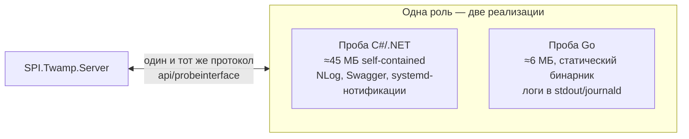

Сервер не отличает её от обычной пробы: тот же протокол (CheckIn / SetJobs / TaskIds /
TaskStatus / CheckData / ConfirmData), тот же формат JSON, та же ACK-доставка
результатов, инкрементальное слияние задач, cron-расписания (включая секунды),
пул воркеров `Probe:MaxParallel`, персист `TaskInfo.json`/`JobResult.json`, ключ API.
В списке проб она видна с версией `go-0.1.0`. Конфигурация — тот же `appsettings.json`.

Проверено сквозным тестом против настоящего сервера: подтверждение, автодоставка
задач сверкой, выполнение по cron, доставка результатов с подтверждением,
живой статус задач через прокси `probetaskstatus`, удаление пробы.

| | Проба C# | Проба Go |
|---|---|---|
| Размер (self-contained) | ~45 МБ | **~6 МБ** |
| Зависимости на хосте | нет (или .NET Runtime для framework-сборки) | **нет вообще** |
| Логи | файлы NLog + gzip | stdout / journald |
| Swagger на пробе | есть | нет |
| Статус | основная | экспериментальная |

Получить: архив `twamp-probe-go-*-linux-x64.tar.gz` со [страницы релизов](https://github.com/akprof2000/twamp-probe/releases)
или локальная сборка `go-probe/build-linux.cmd` (нужен Go 1.23+). Развёртывание —
скопировать папку и запустить; подробности в [go-probe/deploy/README-DEPLOY.txt](go-probe/deploy/README-DEPLOY.txt).

---

## Веб-интерфейс оператора

Открывается по адресу сервера (`http://сервер:9000/`). Если включён ключ API — введите его в поле справа сверху (сохраняется в браузере).

| Вкладка | Возможности |
|---|---|
| **Статус проб** | связь/ошибки/backoff, версия пробы, число задач и результатов; кнопка **«задачи»** — живой **составной статус** выполнения на пробе: запустилась ли задача, как завершился процесс (успех «код 0» / ошибка «код N» / не запустился / таймаут), счётчики успехов и ошибок, краткий результат (итоговая строка вывода зонда), следующий запуск; кнопки **«имя»** (переименовать пробу) и **«удалить»** — удаление с остановкой опроса (спросит, удалять ли и её задачи); у неопознанных проб — кнопка **«Отклонить»** |
| **Задачи** | **серверная пагинация** (задач может быть >10 000) и **фильтры по всем столбцам**: название, проба, узел, тип, статус (активные/удалённые/все), исход выполнения (успех / ошибка приложения / убито по таймауту / не запустилась / нет данных), текст ошибки; **массовые операции над отфильтрованным** — удалить или восстановить всё одним нажатием; у удалённых задач кнопка «восстановить»; два статуса последнего запуска («Выполнение» + «Результат» с текстом ошибки); после перезапуска сервера статусы восстанавливаются из БД |
| **Загрузка** | наборы шаблонов (загрузка/удаление) → файл маршрутизаторов с выбором набора (предпросмотр или создание) → либо готовый CSV задач |
| **Отчёт** | выгрузка CSV за период |

Все кнопки показывают индикатор ожидания «⏳». Вкладки «Статус проб» (включая открытую таблицу задач пробы) и «Задачи» обновляются **по событиям сервера**: интерфейс висит на «длинном опросе» `WaitChanges` и перерисовывается мгновенно при изменении задач, поступлении результатов или смене состояния проб (плюс страховочное обновление раз в ~25 с). Ожидание асинхронное и не нагружает сервер; при скрытом окне браузера соединение не держится.

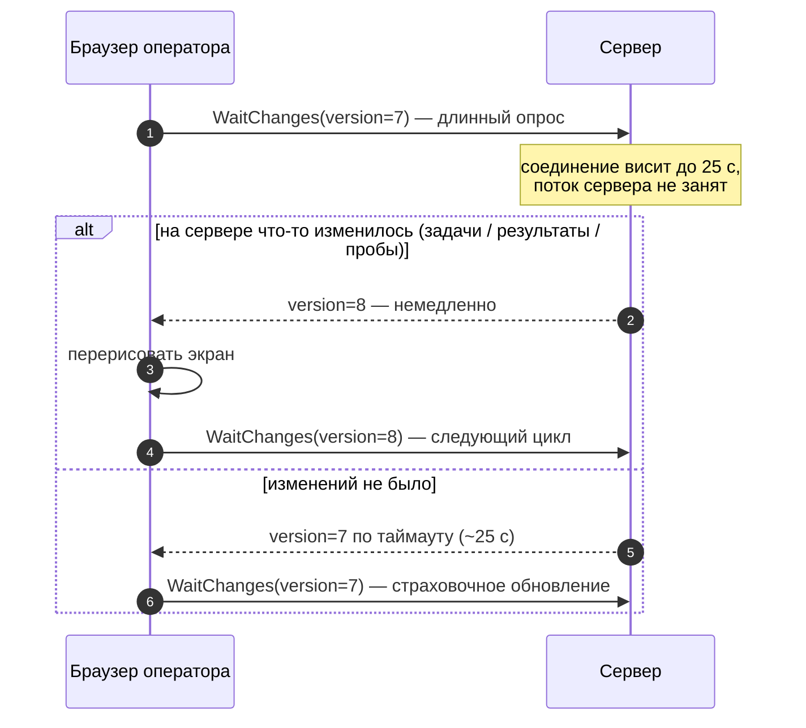

В колонку `Errors` отчёта попадают **все** ошибки запуска: stderr процесса, прерывание по таймауту, ненулевой код выхода и невозможность запустить зонд.

Swagger доступен по `/swagger` на обоих приложениях (кнопка **Authorize** — для ключа API).

---

## Форматы файлов

### 1. Файл шаблонов (CSV, разделитель `;`, с заголовками)

Шаблоны организованы в **именованные наборы**: каждый загруженный файл — отдельный набор (имя по умолчанию — имя файла, можно задать параметром `name`). Наборов может быть сколько угодно; при заливке маршрутизаторов выбирается **конкретный набор** (или все сразу); ненужный набор удаляется одной командой. Повторная загрузка набора с тем же именем обновляет его, не трогая остальные.

Порядок колонок **любой** (маппинг по имени заголовка), большинство колонок необязательны.

```csv
Name;Probe;Request;Type;Repeats;Circles;Pause;Cron;Start;End;Mode;TimeOut
d46;http://10.0.0.5:8443;-c 300 -i 1 -D 46 -s 224;Scheduler;1;1;0;*/6 * * * *;;2 week 3 day;TWamp;30
fast;http://10.0.0.5:8443;-n 1;Repeater;1;1;0;;;1 day;WinPing;10
```

| Колонка | Обязательна | Описание |
|---|---|---|
| `Name` | нет | имя шаблона — входит в название задачи |
| `Probe` | **да** | адрес пробы, которая выполняет задачи шаблона |
| `Request` | нет | аргументы командной строки зонда (адрес узла подставляет проба) |
| `Type` | нет | `Scheduler` (по расписанию, по умолчанию) или `Repeater` (однократно) |
| `Repeats` / `Circles` / `Pause` | нет | повторы в цикле / число циклов / пауза между циклами (сек) |
| `Cron` | нет | cron-выражение расписания |
| `Start` / `End` | нет | **дата** (`25.12.2026 10:00`) **или длительность** от момента создания. Единицы — английские `year month week day hour min sec` (понимается и опечатка `weak`) и **русские во всех склонениях**: `1 год 2 месяца 2 недели 15 дней`, `2 года 1 неделя день`, `5 лет`, `3 часа 30 минут`. Число можно опускать (единица = 1): `weak`, `year month weak`. Есть **компактная запись** одиночными буквами, в том числе слитная: `1y2mD`, `2Г3М1Д`, `ГмД`, `2д`, `м д` (`y/г` год, `m/м` месяц, `w/н` неделя, `d/д` день, `h/ч` час, `s/с` секунда; регистр не важен; минуты — только `min`/`мин`). Годы и месяцы считаются календарно |
| `Mode` | нет | `TWamp` (по умолчанию), `TWampy` или `WinPing` |
| `TimeOut` | нет | таймаут одного запуска зонда, сек (`0` — без ограничения) |

### 2. Файл маршрутизаторов

Выгрузка из системы инвентаризации (M2000 и т. п.) — **CSV с разделителем `;` и строкой заголовков**:

```csv
SNODE;CELL_TYPE;VENDOR;…;IP;…;RNUM
231101|IP:10.106.23.33;4;HUAWEI;…;10.106.23.33;…;3
ADCTO24G|IP:10.23.179.54;4;HUAWEI;…;10.23.179.54;…;4
```

Правила разбора:

- колонки `SNODE` и `IP` находятся **по именам в заголовке** — состав и порядок остальных колонок не важны;
- имя устройства и адрес берутся из `SNODE` вида `ИМЯ|IP:адрес`; если в `SNODE` нет конструкции `|IP:`, именем считается само значение `SNODE`, а адрес — из колонки `IP`;
- для совместимости поддерживаются и файлы с табуляцией (копия из Excel), с заголовком или без него;
- дубликаты (имя+IP) отбрасываются; нераспознанные строки возвращаются в `rejected`.

При заливке создаётся **маршрутизаторы × шаблоны** задач:

- имя задачи: `устройство-IP-шаблон` (например `231101-10.106.23.33-d46`);
- идентификатор задачи **детерминированный** — повторная заливка того же файла обновляет задачи, а не дублирует их;
- IP маршрутизатора — цель зондирования (`EndNode`), проба берётся из шаблона;
- нераспознанные строки возвращаются в поле `rejected` ответа.

### 3. CSV задач (формат «Base test.csv»)

Понимается методом `UploadCsv` и генерируется предпросмотром `PreviewRouters`:

```csv
Name;HostName;Ip;Probe;Request;Type;Repeats;Circles;Pause;Cron;Start;End;Mode;Timeout
231101-10.106.23.33-d46;;10.106.23.33;http://10.0.0.5:8443;-c 300 -i 1;Scheduler;1;1;0;*/6 * * * *;08.07.2026 10:00;25.07.2026 12:00;TWamp;30
```

Даты — в формате `dd.MM.yyyy HH:mm` (настраивается параметром запроса `formatDateTime`).

### 4. Отчёт (выгрузка `DownloadFile`)

CSV с колонками: `Title; Id; Mode; CallLine; FromHost; FromPort; ToHost; ToPort; SID; First; Last; Sent; Lost; LossPercent; RttMin/Median/Max; SendMin/Median/Max; ReflectMin/Median/Max; ReflectProcMin/Max; TwoWayJitter; SendJitter; ReflectJitter; SendHops; ReflectHops; Errors`.

- **`CallLine`** — фактическая команда, которую выполнила проба (например `ping 10.106.23.33 -n 2`) — надёжная идентификация ответа даже после изменения задачи.
- Прерванные по таймауту и ошибочные замеры попадают в отчёт со заполненной колонкой `Errors`.
- Разделители колонок и десятичный разделитель настраиваются параметрами запроса.

---

## HTTP API

Все методы — под префиксом `api/userinterface` (сервер) и `api/probeinterface` (проба). При включённом ключе передавайте заголовок `X-Api-Key`.

### Сервер — управление задачами

| Метод | Путь | Назначение |
|---|---|---|
| GET | `/api/userinterface/tasks` | все задачи |
| GET | `/api/userinterface/tasks/{requestInfo}` | задачи одной пробы |
| POST | `/api/userinterface/tasks` | создать/обновить задачу (JSON `TaskInfo`) |
| DELETE | `/api/userinterface/tasks/{id}` | удалить задачу |
| DELETE | `/api/userinterface/tasks?IPAddress=…` | удалить все задачи пробы |

### Сервер — пробы и мониторинг

| Метод | Путь | Назначение |
|---|---|---|
| POST | `/api/userinterface/checkin?client=http://проба:8443` | опросить пробу (регистрация) |
| GET | `/api/userinterface/listnotidentifyclients` | пробы, ожидающие подтверждения |
| POST | `/api/userinterface/setinfoclient` | подтвердить пробу (запускает опрос) |
| GET | `/api/userinterface/listclients` | подтверждённые пробы |
| DELETE | `/api/userinterface/clients?requestInfo=…&deleteTasks=…` | удалить пробу: остановить опрос, убрать из списка; `deleteTasks=true` — удалить и её задачи |
| DELETE | `/api/userinterface/unidentified?requestInfo=…` | отклонить неопознанную пробу (пустой адрес — вычистить битые записи) |
| GET | `/api/userinterface/probestatus` | статус связи, версия, число задач по каждой пробе |
| GET | `/api/userinterface/probetaskstatus?probe=…` | живой статус выполнения задач на пробе (запущена ли, следующий запуск, ошибка) |
| GET | `/api/userinterface/lastresults` | последние результаты по задачам (момент + признак ошибки) |
| GET | `/api/userinterface/waitchanges?version=N` | длинный опрос изменений (до 25 с): ответ сразу при изменении задач/результатов/проб |
| GET | `/api/userinterface/taskspage?skip&take&title&probe&node&type&status&outcome&error` | страница задач с фильтрами по всем столбцам |
| POST | `/api/userinterface/tasksbulk?action=delete\|restore&…фильтры` | массовое удаление/восстановление всего отфильтрованного |
| POST | `/api/userinterface/tasks/{id}/restore` | восстановить удалённую задачу |

### Сервер — массовая заливка и отчёты

| Метод | Путь | Назначение |
|---|---|---|
| POST | `/api/userinterface/uploadtemplates?name=…` | загрузить набор шаблонов (multipart, поле `file`; имя по умолчанию — имя файла) |
| GET | `/api/userinterface/templatesets` | список наборов (имя + число шаблонов) |
| GET | `/api/userinterface/templates` | все шаблоны всех наборов |
| DELETE | `/api/userinterface/templates?set=…` | удалить набор шаблонов |
| POST | `/api/userinterface/uploadrouters?set=…` | файл маршрутизаторов → **создать** задачи (набор × строки; без `set` — все наборы) |
| POST | `/api/userinterface/previewrouters?set=…` | то же, но вернуть CSV **без создания** |
| POST | `/api/userinterface/UploadCsv` | загрузить готовый CSV задач |
| GET | `/api/userinterface/downloadfile?from=…&to=…` | потоковая выгрузка отчёта CSV |

### Проба (используется сервером)

| Метод | Путь | Назначение |
|---|---|---|
| POST | `/api/probeinterface/checkin?requestInfo=…` | идентификация пробы (адреса, версия) |
| POST | `/api/probeinterface/setjobs` | принять **изменившиеся** задачи (инкрементальное слияние) |
| GET | `/api/probeinterface/taskids` | идентификаторы задач, известных пробе (для сверки) |
| GET | `/api/probeinterface/taskstatus` | состояние выполнения задач (running, старт/финиш, следующий запуск, ошибка) |
| GET | `/api/probeinterface/checkdata` | длинный опрос: пачка результатов с `batchId` |
| POST | `/api/probeinterface/confirmdata?batchId=…` | подтвердить запись пачки (проба удаляет её) |

---

## Механизмы надёжности

### Доставка результатов «ровно один раз»

Схема процесса — [выше](#гарантированная-доставка-результатов-ровно-один-раз). Словами:

1. Проба копит результаты в очереди (`ResultStore`).
2. `CheckData` выдаёт пачку с `BatchId` и **не удаляет** её.
3. Сервер пишет в БД, отбрасывая дубликаты по `ResultId` каждого результата.
4. Сервер вызывает `ConfirmData` — только теперь проба удаляет пачку.
5. Если сервер упал между шагами 3 и 4 — при следующем опросе проба выдаст ту же пачку, дубликаты отсеются.

Недоставленные результаты переживают перезапуск пробы (файл `JobResult.json`). Очередь ограничена (`Probe:MaxPendingResults`) — при многодневной недоступности сервера вытесняются самые старые.

### Инкрементальная синхронизация задач

Схема сверки — [выше](#фоновая-сверка-задач-самовосстановление). Словами:

- Изменения передаются пробе адресно: одна задача — один элемент в `SetJobs`; массовая заливка — пачками до 1000.
- Проба сливает изменения в свой реестр (добавить/обновить/удалить) и хранит его в `TaskInfo.json`.
- Фоновая сверка каждые `ReconcileIntervalSec`: сервер сравнивает `TaskIds` пробы со своей БД, **досылает недостающее** (чистая переустановленная проба конфигурируется сама), **удаляет** с пробы устаревшие (`End` в прошлом) и неизвестные серверу задачи.

### Ретенция и обслуживание LiteDB

Два фоновых процесса не дают базе расти бесконечно:

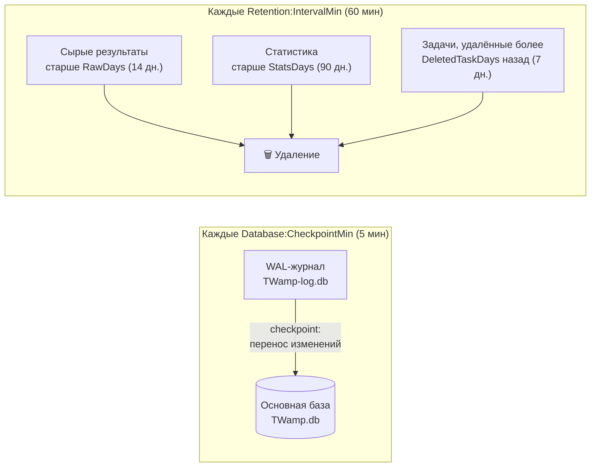

Без checkpoint WAL-журнал (`*-log.db`) растёт неограниченно при интенсивной записи результатов.

### Автоматическая очистка при удалении пробы

Обе стороны сами наводят порядок, когда проба и сервер теряют друг друга
(время в **часах**, настраивается с обеих сторон):

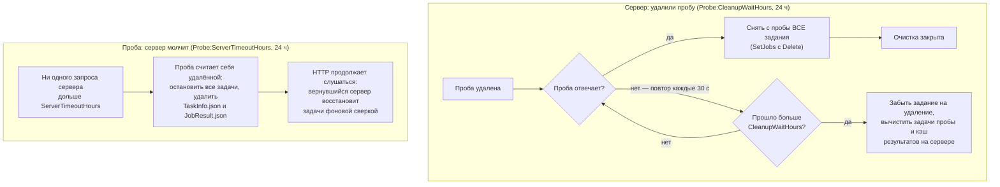

- **Сервер**: при удалении пробы создаётся отложенная очистка; фоновый цикл пытается снять с пробы все задания. Появилась в течение `Probe:CleanupWaitHours` — задания сняты, очистка закрыта. Не появилась — задание на удаление снимается, задачи пробы и кэш её результатов вычищаются из БД.
- **Проба** (и C#, и Go): если сервер не обращался дольше `Probe:ServerTimeoutHours`, проба останавливает все задачи и удаляет реестр с кэшем результатов. Слушать HTTP она не перестаёт: если сервер вернётся, самосинхронизация всё восстановит.

### Таймаут задачи

`TimeoutSec` задаётся на задачу. Проба ждёт процесс зонда указанное время, затем принудительно завершает всё дерево процессов; частичный вывод и пометка «прервано по таймауту» попадают в результат.

---

## Безопасность

- Задайте **одинаковый** ключ в `Auth:ApiKey` сервера и всех проб (или `Auth__ApiKey` через окружение). Пустой ключ = аутентификация выключена (допустимо только в изолированной сети).
- Все запросы к `/api/**` требуют заголовок `X-Api-Key`; веб-интерфейс и Swagger остаются доступны (UI сам передаёт ключ).
- Сервер автоматически подписывает ключом все запросы к пробам.

> Проба исполняет команды ОС по указанию сервера — не оставляйте её без ключа в недоверенной сети.

---

## Производительность

Замеры на 16-ядерной машине (проба и сервер локально):

| Сценарий | Результат |
|---|---|
| 10 000 задач одним `SetJobs` | приняты без зависаний, веб-интерфейс отвечает |
| 10 000 ping-задач, `MaxParallel=64` | все выполнены за ~24 с (~420 результатов/с) |
| Массовая заливка 2 000 задач (1000 роутеров × 2 шаблона) | доставка пробе за ~5 с двумя пачками |
| Сквозная доставка 505 задач сервер→проба→сервер | 504/505 результатов в БД (1 потерян только при одновременном kill обеих служб — до внедрения ACK; с ACK потери исключены) |

Ключевые решения: неблокирующий длинный опрос (Channel вместо блокировки потока), пул воркеров вместо неограниченного `Task.Run`, пакетная доставка задач, разбор статистики при приёме, потоковая выгрузка отчётов.

### Дисковая нагрузка пробы

Проба спроектирована так, чтобы писать на диск минимально:

- очередь недоставленных результатов сохраняется **снимком по таймеру** (`Probe:PersistIntervalSec`, по умолчанию 5 с) и только при наличии изменений — не на каждый результат и не на каждую выдачу/подтверждение пачки; при штатной остановке делается финальный снимок;
- если сервер долго недоступен и очередь разрослась, интервал сохранения **автоматически растягивается** (средняя скорость записи снимков ограничена ~10 МБ/с) — гигантский файл не переписывается впустую;
- файловые логи пишутся с уровня **Info** (Debug-поток тысяч зондов идёт только в консоль с ограничителем), файл лога держится открытым, записи буферизуются асинхронной обёрткой.

---

## Разработка

```
SPI.TWamp.slnx              — решение (.NET 10)
├── SPI.TWamp.Probe/        — проба (ASP.NET Core)
├── SPI.Twamp.Server/       — сервер (ASP.NET Core, LiteDB)
└── SPI.Twamp.Tests/        — юнит-тесты (xUnit)
```

Сборка и тесты:

```bash
dotnet build SPI.TWamp.slnx -c Release
dotnet test SPI.Twamp.Tests/SPI.Twamp.Tests.csproj -c Release
```

Тестами покрыты: разбор длительностей шаблонов (`TimeSpec`), разбор строк файла маршрутизаторов, детерминированные идентификаторы задач, парсер вывода `twping`, **парсер вывода `twampy` и его сходимость по значениям с twping** (`TwampyParserTests`), слияние задач в реестре пробы.

CI: GitHub Actions ([.github/workflows/build.yml](.github/workflows/build.yml)) — сборка решения и тесты .NET **плюс** gofmt/vet/тесты/сборка Go-пробы (linux и windows) на каждый push/PR в `main`. У Go-пробы свои юнит-тесты (`go-probe/*_test.go`): контракты JSON (PascalCase/числовые enum от сервера, camelCase-ответы), конфигурация с BOM, ACK-доставка с повторной выдачей, слияние задач, очистка сторожем.

### Релизы

Пуш тега `v*` (например `v1.2.0`) запускает [.github/workflows/release.yml](.github/workflows/release.yml):
собираются **шесть архивов** (в каждом — папка приложения целиком) и публикуются в GitHub Release.
Версия из тега прошивается во все сборки: .NET-приложения получают её в `AssemblyVersion`
(локальные сборки — версию из `Directory.Build.props`), Go-проба — через `ldflags`;
она видна в списке проб на сервере.

| Архив | Вариант | Требования на хосте |
|---|---|---|
| `twamp-server-*-framework.tar.gz` | сервер, маленький (~7 МБ) | установленный .NET 10 Runtime (ASP.NET Core) |
| `twamp-server-*-selfcontained.tar.gz` | сервер, самодостаточный (один исполняемый файл со всеми библиотеками) | нет — распаковал и запустил |
| `twamp-probe-*-framework.tar.gz` | проба C#, маленькая | .NET 10 Runtime (ASP.NET Core) |
| `twamp-probe-*-selfcontained.tar.gz` | проба, самодостаточная | нет; для режима TWampy — Python 3.8+ |

Выпуск релиза:

```bash
git tag v1.2.0 && git push origin v1.2.0
```

Ручной запуск workflow (без тега) собирает те же архивы как артефакты сборки.
Runtime-файлы состояния (`TaskInfo.json`, `JobResult.json`, `Base test.csv`) в дистрибутивы не попадают.

Стиль кода: clean-архитектура (слои с интерфейсами, тонкие контроллеры), XML-документация и комментарии — **на русском языке**.

---

## Обновление

- Пробу и сервер обновляйте **согласованно**: контракт обмена результатами (пачки с подтверждением) несовместим со старыми версиями второй стороны.
- Версия каждой пробы видна на странице статуса — после раскатки легко найти отставшие.
- БД (LiteDB) миграций не требует: новые поля читаются со значениями по умолчанию, исторические сырые результаты выгружаются в отчёт через путь совместимости.
