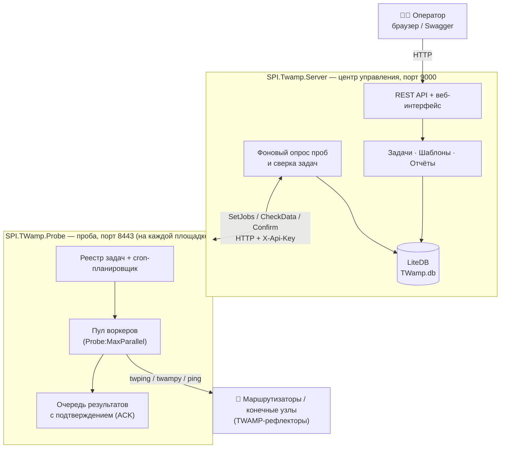
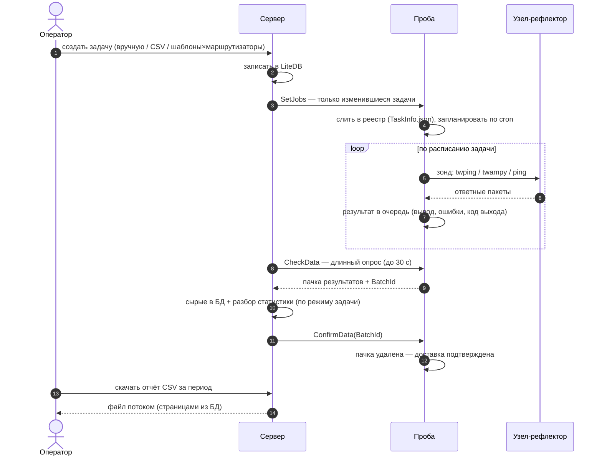
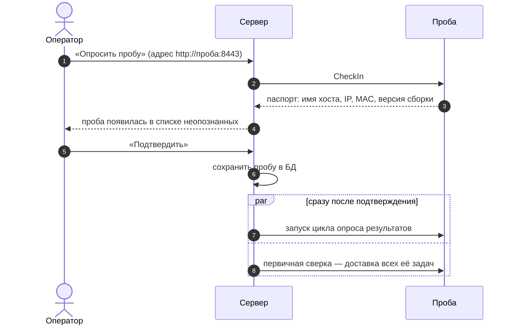
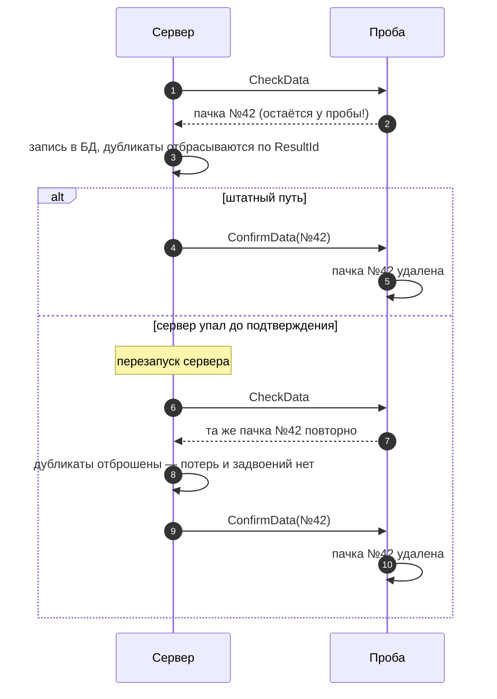
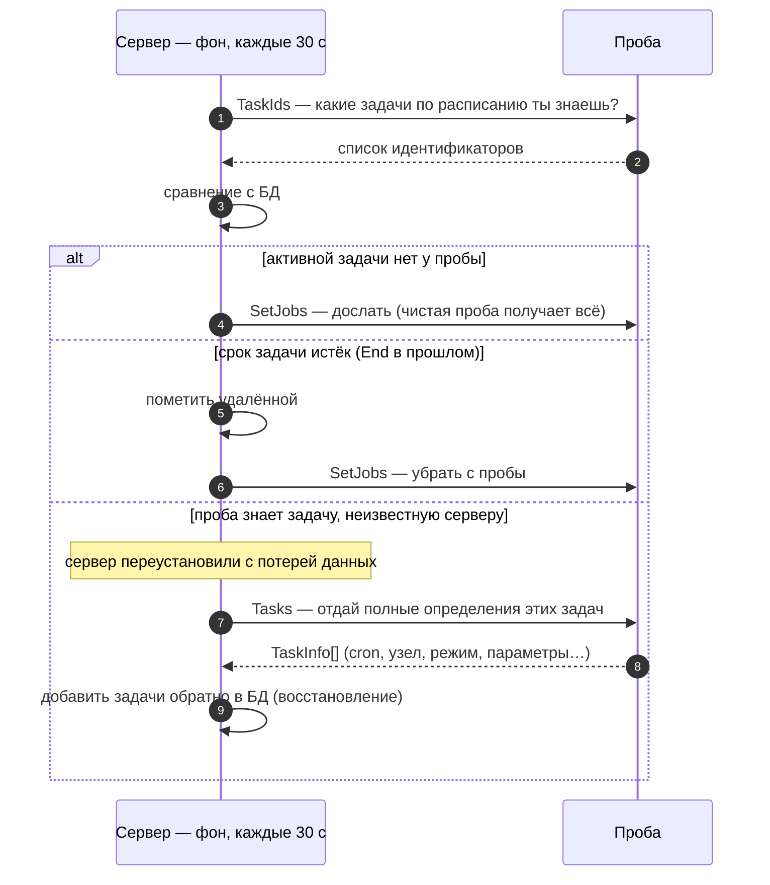
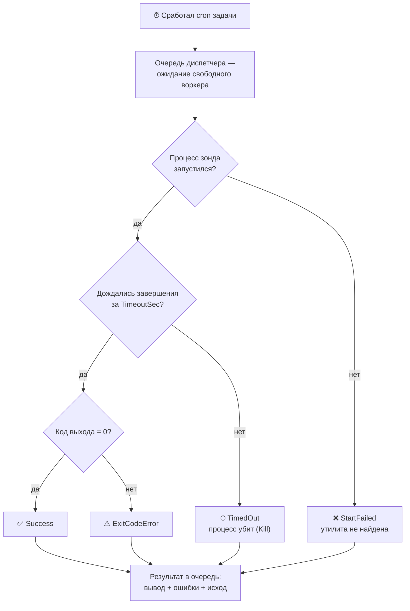
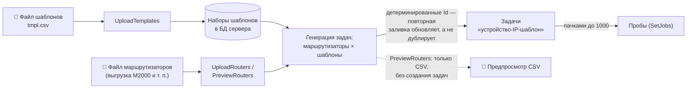
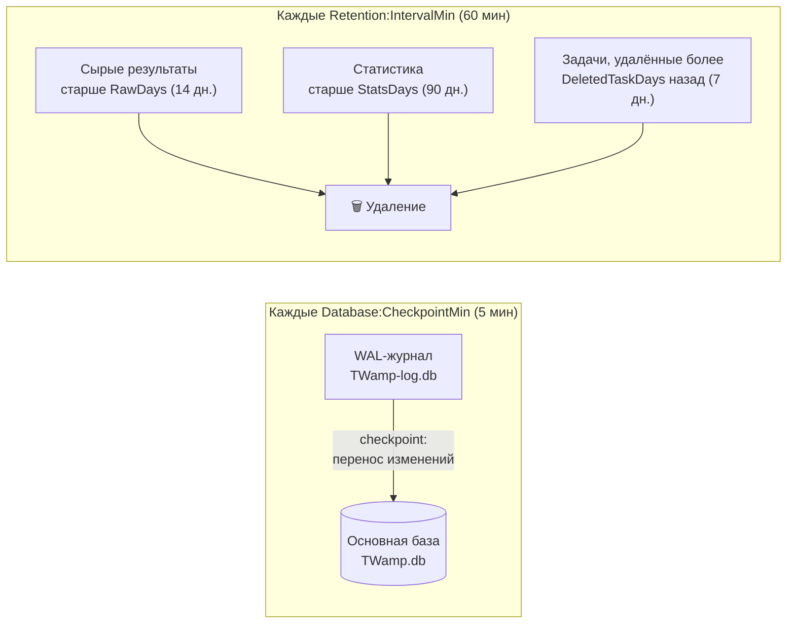
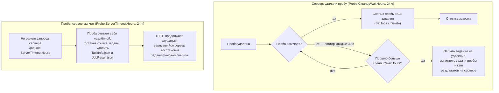

[← К обзору проекта (README)](../README.md) · [Вся документация](README.md)

---

## Архитектура

Система состоит из двух приложений (.NET 10, ASP.NET Core). Сервер один, проб — сколько угодно.

**Сервер** (`SPI.Twamp.Server`) — центр управления:

| Слой | Содержимое |
|---|---|
| `Contracts/` | модели данных (задачи, результаты, шаблоны, статистика) |
| `Abstractions/` | интерфейсы репозиториев и сервисов |
| `Infrastructure/` | LiteDB-репозитории, HTTP-клиент пробы (Flurl) |
| `Application/` | бизнес-логика: задачи, клиенты, отчёты, массовая заливка |
| `BackgroundServices/` | опрос проб, сверка задач, ретенция БД |
| `Controllers/` | тонкие REST-контроллеры: задачи, пробы/мониторинг, отчёты/заливка |
| `wwwroot/` | веб-интерфейс оператора (одна страница) |

**Проба** (`SPI.TWamp.Probe`) — исполнитель на площадке:

| Компонент | Назначение |
|---|---|
| `Worker` | реестр задач, инкрементальное слияние изменений |
| `ProbeDispatcher` | пул воркеров — ограниченная параллельность запуска зондов |
| `ProbeRunner` | асинхронный запуск процесса зонда, таймаут с принудительным завершением |
| `CronExecuter` | планирование по cron-выражению (NCrontab) |
| `ResultStore` | очередь результатов с подтверждением доставки (ACK) |

---
## Как это работает: процессы на схемах

### Жизненный цикл задачи — от создания до отчёта

Главный сквозной процесс системы: оператор описывает задачу, сервер доставляет её
пробе, проба измеряет по расписанию, результаты возвращаются и превращаются в отчёт.

### Подключение новой пробы

Проба не требует настройки на своей стороне — её «знакомит» с сервером оператор.

### Гарантированная доставка результатов («ровно один раз»)

Пачка не удаляется с пробы, пока сервер не подтвердит запись — сбой любой из сторон
не теряет и не задваивает данные.

### Фоновая сверка задач (самовосстановление)

Каждые `Probe:ReconcileIntervalSec` (по умолчанию 30 с) сервер выравнивает список
задач каждой пробы со своей БД. Благодаря этому чистая переустановленная проба
конфигурируется сама, а устаревшие задачи не «зависают».

> **Восстановление после потери данных.** Если сервер переустановили и его БД
> пуста, все задачи пробы становятся «сиротами». Сервер не удаляет их, а
> **забирает с пробы полные определения** (эндпоинт `Tasks`) и добавляет обратно
> в свою БД — так живая проба «возвращает» серверу его задачи. Удалённые задачи
> при этом не воскресают: реальные удаления хранятся на сервере как «надгробия»
> (`Delete=true`) до истечения ретенции, поэтому сиротой считается лишь задача,
> о которой у сервера нет вообще никаких записей.

### Выполнение зонда на пробе: исходы запуска

Каждый запуск заканчивается одним из четырёх исходов — он виден в статусе задач
и попадает в отчёт (колонка `Errors` собирает stderr, таймаут и код выхода).

### Массовая заливка: шаблоны × маршрутизаторы

Тысячи задач создаются одним запросом: набор шаблонов накладывается на выгрузку
маршрутизаторов из системы инвентаризации.

---
## Механизмы надёжности

### Доставка результатов «ровно один раз»

Схема процесса — [выше](#гарантированная-доставка-результатов-ровно-один-раз). Словами:

1. Проба копит результаты в очереди (`ResultStore`).
2. `CheckData` выдаёт пачку с `BatchId` и **не удаляет** её.
3. Сервер пишет в БД, отбрасывая дубликаты по `ResultId` каждого результата.
4. Сервер вызывает `ConfirmData` — только теперь проба удаляет пачку.
5. Если сервер упал между шагами 3 и 4 — при следующем опросе проба выдаст ту же пачку, дубликаты отсеются.

Недоставленные результаты переживают перезапуск пробы (файл `JobResult.json`). Очередь ограничена (`Probe:MaxPendingResults`) — при многодневной недоступности сервера вытесняются самые старые.

### Инкрементальная синхронизация задач

Схема сверки — [выше](#фоновая-сверка-задач-самовосстановление). Словами:

- Изменения передаются пробе адресно: одна задача — один элемент в `SetJobs`; массовая заливка — пачками до 1000.
- Проба сливает изменения в свой реестр (добавить/обновить/удалить) и хранит его в `TaskInfo.json`.
- Фоновая сверка каждые `ReconcileIntervalSec`: сервер сравнивает `TaskIds` пробы со своей БД, **досылает недостающее** (чистая переустановленная проба конфигурируется сама), **удаляет** с пробы устаревшие (`End` в прошлом).
- **Восстановление сервера**: задачи, которые есть на пробе, но которых нет в БД сервера (после его переустановки с потерей данных), сервер **забирает с пробы и добавляет к себе** (а не удаляет) — см. врезку выше.

### Ретенция и обслуживание LiteDB

Два фоновых процесса не дают базе расти бесконечно:

WAL-журнал (`*-log.db`) в первую очередь ограничивает **встроенный авто-checkpoint LiteDB**
(по порогу в страницах журнала, срабатывает на пути записи). Периодический checkpoint из
обслуживания — лишь подстраховка: под интенсивной записью он не всегда успевает взять
эксклюзивную блокировку и тогда пропускается с кратким предупреждением (не ошибкой),
не влияя на работу — журнал всё равно сводит авто-checkpoint.

### Автоматическая очистка при удалении пробы

Обе стороны сами наводят порядок, когда проба и сервер теряют друг друга
(время в **часах**, настраивается с обеих сторон):

- **Сервер**: при удалении пробы создаётся отложенная очистка; фоновый цикл пытается снять с пробы все задания. Появилась в течение `Probe:CleanupWaitHours` — задания сняты, очистка закрыта. Не появилась — задание на удаление снимается, задачи пробы и кэш её результатов вычищаются из БД.
- **Проба** (и C#, и Go): если сервер не обращался дольше `Probe:ServerTimeoutHours`, проба останавливает все задачи и удаляет реестр с кэшем результатов. Слушать HTTP она не перестаёт: если сервер вернётся, самосинхронизация всё восстановит.

### Таймаут задачи

`TimeoutSec` задаётся на задачу. Проба ждёт процесс зонда указанное время, затем принудительно завершает всё дерево процессов; частичный вывод и пометка «прервано по таймауту» попадают в результат.

---

---

[← К обзору проекта (README)](../README.md) · [Вся документация](README.md)

---
