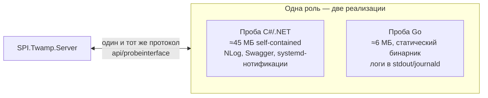

[← К обзору проекта (README)](../README.md) · [Вся документация](README.md)

---

## Проба на Go (экспериментальная)

Помимо основной C#-пробы в репозитории живёт её порт на Go — [go-probe/](../go-probe/).
Это **один статический бинарник ~6 МБ без единой зависимости**: не нужен ни .NET,
ни библиотеки конкретного дистрибутива — работает на любом Linux x86-64
(CentOS 7/8/9, Rocky, Alma, Ubuntu, Debian…).

Сервер не отличает её от обычной пробы: тот же протокол (CheckIn / SetJobs / TaskIds /
TaskStatus / CheckData / ConfirmData), тот же формат JSON, та же ACK-доставка
результатов, инкрементальное слияние задач, cron-расписания (включая секунды),
пул воркеров `Probe:MaxParallel`, персист `TaskInfo.json`/`JobResult.json`, ключ API.
В списке проб она видна с версией `go-0.1.0`. Конфигурация — тот же `appsettings.json`.

Проверено сквозным тестом против настоящего сервера: подтверждение, автодоставка
задач сверкой, выполнение по cron, доставка результатов с подтверждением,
живой статус задач через прокси `probetaskstatus`, удаление пробы.

| | Проба C# | Проба Go |
|---|---|---|
| Размер (self-contained) | ~45 МБ | **~6 МБ** |
| Зависимости на хосте | нет (или .NET Runtime для framework-сборки) | **нет вообще** |
| Логи | файлы NLog + gzip | stdout / journald |
| Swagger на пробе | есть | нет |
| Статус | основная | экспериментальная |

Получить: архив `twamp-probe-go-*-linux-x64.tar.gz` со [страницы релизов](https://github.com/akprof2000/twamp-probe/releases)
или локальная сборка `go-probe/build-linux.cmd` (нужен Go 1.23+). Развёртывание —
скопировать папку и запустить; подробности в [go-probe/deploy/README-DEPLOY.txt](../go-probe/deploy/README-DEPLOY.txt).

---

---

[← К обзору проекта (README)](../README.md) · [Вся документация](README.md)

---
