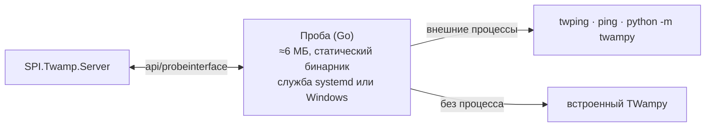

[← К обзору проекта (README)](../README.md) · [Вся документация](README.md)

---

## Проба

Проба живёт в [go-probe/](../go-probe/) и написана на Go. Это **один статический
бинарник ~6 МБ без единой зависимости**: не нужен ни .NET, ни библиотеки
конкретного дистрибутива — работает на любом Linux x86-64 (CentOS 7/8/9, Rocky,
Alma, Ubuntu, Debian…) и на Windows.

Раньше рядом жила вторая реализация на C#/.NET. От неё отказались: Go-проба
делает то же самое, но весит в семь раз меньше, ничего не требует на хосте и
умеет выполнять TWampy без внешнего python. Держать две реализации одного
протокола значило чинить каждую находку дважды.


```mermaid
flowchart LR
    server["SPI.Twamp.Server"]
    probe["Проба (Go)<br/>≈6 МБ, статический бинарник<br/>служба systemd или Windows"]
    server <-->|"api/probeinterface"| probe
    probe -->|"внешние процессы"| tools["twping · ping · python -m twampy"]
    probe -->|"без процесса"| emb["встроенный TWampy"]
```

Сервер не отличает её от обычной пробы: тот же протокол (CheckIn / SetJobs / TaskIds /
TaskStatus / CheckData / ConfirmData), тот же формат JSON, та же ACK-доставка
результатов, инкрементальное слияние задач, cron-расписания (включая секунды),
пул воркеров `Probe:MaxParallel`, персист `TaskInfo.json`/`JobResult.json`, ключ API.
В списке проб она видна с версией вида `1.8.0-go`. Конфигурация — тот же `appsettings.json`.

Проверено сквозным тестом против настоящего сервера: подтверждение, автодоставка
задач сверкой, выполнение по cron, доставка результатов с подтверждением,
живой статус задач через прокси `probetaskstatus`, удаление пробы.

| | Значение |
|---|---|
| Размер | ~6 МБ, один файл |
| Зависимости на хосте | нет вообще |
| Логи | консоль + файл с ротацией и gzip (log/slog) |
| Установка службой | `install-centos.sh` (systemd) или `install-windows.ps1` |
| Режимы замеров | TWamp и TWampy — внешней утилитой **или встроенным зондом**; WinPing (`ping`) — только внешне |
| Предел одновременных замеров | из настройки `Probe:MaxParallel` (по умолчанию 100000), без урезания. Внешние замеры упираются в лимиты ОС, встроенные — только в память ([подробнее](parallelism.md)) |
| Локальные порты зондов | раздаёт сама проба из `Probe:PortRange`; когда свободных нет — замер ждёт, а не падает ([алгоритм](parallelism.md#как-проба-выбирает-локальные-порты)) |

### Встроенные зонды против внешних утилит

Режимы TWamp и TWampy проба умеет выполнять двумя путями: запуская внешнюю
программу либо прямо в своём процессе. Включается в `appsettings.json`:

```json
"twamp":  { "embedded": true },
"twampy": { "embedded": true }
```

Ниже — измерения, а не оценки. Стенд: контейнер с оригинальным perfSONAR owamp
(`twampd` собран из исходников), клиент и сервер на одной машине, режим TWamp.

**Значения замеров совпадают.** 5 прогонов по 100 пакетов с интервалом 10 мс,
медиана времени кругового обхода:

| Клиент | Медианы по прогонам, мс | Итог | Потери |
|---|---|---|---|
| `twping` (perfSONAR, оригинал на C) | 0.40 0.40 0.40 0.40 0.40 | **0.40 мс** | 0.000% |
| `twping-go`, внешняя утилита | 0.25 0.35 0.25 0.45 0.35 | **0.35 мс** | 0.000% |
| `twping-go`, **встроенный** | 0.35 0.35 0.35 0.25 0.35 | **0.35 мс** | 0.000% |

Внешний и встроенный дают одно и то же — у них общий код: утилита `twping` и
проба вызывают одну функцию библиотеки [twping-go](https://github.com/akprof2000/twping-go).
Расхождение с оригиналом на C — один шаг гистограммы, на петле это предел
разрешения.

**Различаются ресурсы.** 50 одновременных замеров, каждый по 20 секунд:

| Показатель | Внешняя утилита | Встроенный зонд |
|---|---|---|
| Процессов ОС | **50** | **0** |
| Потоков у пробы | 58 | 22 |
| Память: проба | 31 МБ | 41 МБ |
| Память: процессы зондов | **317 МБ** | — |
| **Память суммарно** | **340 МБ** | **41 МБ** |
| На один замер | ~6.3 МБ + процесс + поток | ~0.2 МБ, горутина |

**Стоимость запуска** (100 повторов, только старт программы без замера):

| Что запускается | Время на запуск |
|---|---|
| `twping` (C) | 0.8 мс |
| `twping-go` (статический бинарник Go) | 2.6 мс |
| `python3` — минимум для TWampy | **25 мс** |
| встроенный зонд | вызов функции, `fork`/`exec` нет |

Само время замера от режима не зависит: его задаёт протокол TWAMP —
установление сессии и ожидание пакетов по расписанию. Выигрыш встроенного пути
не в скорости одного замера, а в том, сколько их идёт одновременно.

**Что это значит на практике**

| | Внешняя утилита | Встроенный зонд |
|---|---|---|
| Предел одновременных замеров | лимитами ОС: каждый замер стоит процесса и потока ([почему](parallelism.md)) | только памятью и сетью |
| Поведение при исчерпании лимита | ядро отказывает в потоке → служба падает целиком | предел не задействован |
| Что нужно на хосте | `twping` рядом с пробой; для TWampy — Python 3.8+ | ничего |
| Отмена задачи и таймаут | убийством процесса | отменой контекста, в том числе на подключении |
| Формат вывода | эталон | тот же (сверено построчно) |

Встроенный режим по умолчанию **выключен**: обновление пробы не меняет поведение
молча. Включайте осознанно — когда упираетесь в число одновременных замеров или
хотите убрать с хоста зависимости.

### Журнал Go-пробы

Пишется в консоль и в файл с ротацией по размеру; архивы сжимаются в `.gz`, старые
удаляются. Формат строки совпадает с журналом сервера — оба читаются одинаково:

```
2026-07-24 09:48:23.123 INFO  [dispatcher] Пул воркеров запущен воркеров=256 ёмкость_очереди=100000
```

Настройки — секция `Logging` в `appsettings.json`:

| Ключ | По умолчанию | Назначение |
|---|---|---|
| `Logging:Level` | `Info` | порог записи: `Trace`/`Debug`/`Info`/`Warn`/`Error` |
| `Logging:Dir` | `log` | каталог файлов журнала |
| `Logging:FileName` | `probe.log` | имя текущего файла |
| `Logging:MaxSizeMb` | `10` | размер, после которого файл уходит в архив |
| `Logging:MaxFiles` | `20` | сколько архивов хранить (старые удаляются) |
| `Logging:Console` | `true` | дублировать вывод в консоль |
| `Logging:Compress` | `true` | сжимать архивы в `.gz` |

Получить: архив `twamp-probe-go-*-linux-x64.tar.gz` со [страницы релизов](https://github.com/akprof2000/twamp-probe/releases)
или локальная сборка `go-probe/build-linux.cmd` (нужен Go 1.23+). Развёртывание —
скопировать папку и запустить; подробности в [go-probe/deploy/README-DEPLOY.txt](../go-probe/deploy/README-DEPLOY.txt).

---

---

[← К обзору проекта (README)](../README.md) · [Вся документация](README.md)

---
