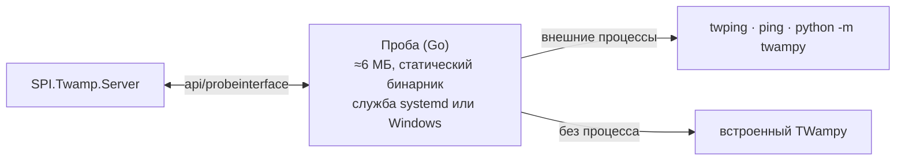

[← К обзору проекта (README)](../README.md) · [Вся документация](README.md)

---

## Проба

Проба живёт в [go-probe/](../go-probe/) и написана на Go. Это **один статический
бинарник ~6 МБ без единой зависимости**: не нужен ни .NET, ни библиотеки
конкретного дистрибутива — работает на любом Linux x86-64 (CentOS 7/8/9, Rocky,
Alma, Ubuntu, Debian…) и на Windows.

Раньше рядом жила вторая реализация на C#/.NET. От неё отказались: Go-проба
делает то же самое, но весит в семь раз меньше, ничего не требует на хосте и
умеет выполнять TWampy без внешнего python. Держать две реализации одного
протокола значило чинить каждую находку дважды.


```mermaid
flowchart LR
    server["SPI.Twamp.Server"]
    probe["Проба (Go)<br/>≈6 МБ, статический бинарник<br/>служба systemd или Windows"]
    server <-->|"api/probeinterface"| probe
    probe -->|"внешние процессы"| tools["twping · ping · python -m twampy"]
    probe -->|"без процесса"| emb["встроенный TWampy"]
```

Сервер не отличает её от обычной пробы: тот же протокол (CheckIn / SetJobs / TaskIds /
TaskStatus / CheckData / ConfirmData), тот же формат JSON, та же ACK-доставка
результатов, инкрементальное слияние задач, cron-расписания (включая секунды),
пул воркеров `Probe:MaxParallel`, персист `TaskInfo.json`/`JobResult.json`, ключ API.
В списке проб она видна с версией вида `1.8.0-go`. Конфигурация — тот же `appsettings.json`.

Проверено сквозным тестом против настоящего сервера: подтверждение, автодоставка
задач сверкой, выполнение по cron, доставка результатов с подтверждением,
живой статус задач через прокси `probetaskstatus`, удаление пробы.

| | Значение |
|---|---|
| Размер | ~6 МБ, один файл |
| Зависимости на хосте | нет вообще |
| Логи | консоль + файл с ротацией и gzip (log/slog) |
| Установка службой | `install-centos.sh` (systemd) или `install-windows.ps1` |
| Режимы замеров | TWamp (`twping`, в комплекте), WinPing (`ping`), TWampy (python **или встроенный отправитель**) |
| Предел одновременных замеров | до 8000 внешними утилитами; встроенный TWampy — без этого предела ([подробнее](parallelism.md)) |

### Журнал Go-пробы

Пишется в консоль и в файл с ротацией по размеру; архивы сжимаются в `.gz`, старые
удаляются. Формат строки совпадает с журналом сервера — оба читаются одинаково:

```
2026-07-24 09:48:23.123 INFO  [dispatcher] Пул воркеров запущен воркеров=256 ёмкость_очереди=100000
```

Настройки — секция `Logging` в `appsettings.json`:

| Ключ | По умолчанию | Назначение |
|---|---|---|
| `Logging:Level` | `Info` | порог записи: `Trace`/`Debug`/`Info`/`Warn`/`Error` |
| `Logging:Dir` | `log` | каталог файлов журнала |
| `Logging:FileName` | `probe.log` | имя текущего файла |
| `Logging:MaxSizeMb` | `10` | размер, после которого файл уходит в архив |
| `Logging:MaxFiles` | `20` | сколько архивов хранить (старые удаляются) |
| `Logging:Console` | `true` | дублировать вывод в консоль |
| `Logging:Compress` | `true` | сжимать архивы в `.gz` |

Получить: архив `twamp-probe-go-*-linux-x64.tar.gz` со [страницы релизов](https://github.com/akprof2000/twamp-probe/releases)
или локальная сборка `go-probe/build-linux.cmd` (нужен Go 1.23+). Развёртывание —
скопировать папку и запустить; подробности в [go-probe/deploy/README-DEPLOY.txt](../go-probe/deploy/README-DEPLOY.txt).

---

---

[← К обзору проекта (README)](../README.md) · [Вся документация](README.md)

---
