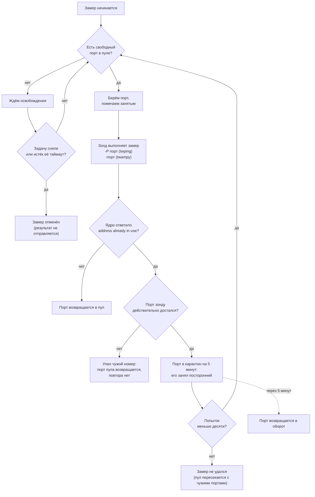
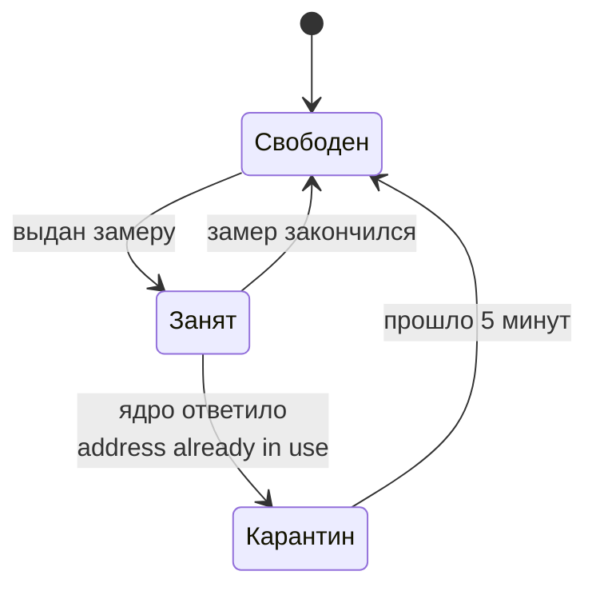

[← К обзору проекта (README)](../README.md) · [Вся документация](README.md)

---

# Сколько замеров можно запускать одновременно

У пробы два пути выполнить замер, и предел у них разный:

| Путь | Чем ограничено число замеров |
|---|---|
| **Встроенный зонд** — замер идёт в процессе пробы | памятью и сетью |
| **Внешняя утилита** — проба запускает `twping`, `python -m twampy`, `ping` | лимитами ОС на процессы и потоки |

Своего потолка проба не навязывает: сколько замеров разрешено, задаёт
`Probe:MaxParallel` (по умолчанию 100000), и это значение не урезается ни под
число ядер, ни под лимиты системы. Если лимитов не хватит, ядро откажет явно —
это видно сразу и правится настройкой системы за минуту, тогда как молчаливое
урезание оставило бы пробу работать вполсилы.

Встроенный путь доступен для режимов **TWamp** и **TWampy**, включается одной
строкой в `appsettings.json`:

```json
"twamp":  { "embedded": true },
"twampy": { "embedded": true }
```

Значения замеров при этом те же, что у внешней утилиты, — это проверено на
стенде с настоящим сервером perfSONAR ([измерения](go-probe.md#встроенные-зонды-против-внешних-утилит)).
В поставляемом `appsettings.json` встроенный режим **включён** для обоих
режимов. На уже установленных пробах поведение от обновления бинарника не
меняется: без ключа в конфиге режим остаётся внешним.

Если внешний путь нужен (режим WinPing, своя сборка `twping`, требование
использовать эталонную утилиту), дальше — сколько его замеров выдержит система,
что происходит при исчерпании лимитов и как их поднять.

Сколько внешних замеров выдержит система: **`ulimit -u` ÷ 2**, потому что
каждый занимает и процесс, и поток. Ориентиры:

| Как запущена проба | Хватит примерно на | Что делать |
|---|---|---|
| CentOS/RHEL после `install-centos.sh` | **32 000** (`LimitNPROC=65535`) | ничего, скрипт всё настроил |
| CentOS/RHEL, запуск из консоли | по жёсткому `ulimit -u`, обычно десятки тысяч | ничего — проба сама поднимает мягкий лимит |
| служба systemd без `LimitNPROC` | **2048** (штатные 4096) | поднять `LimitNPROC` в юните |
| Windows | лимита такого рода нет | ничего |

---

## Почему внешний замер стоит двух единиц, а не одной

Запуская внешнюю программу, проба должна дождаться её завершения и прочитать
вывод. Ожидание процесса на Unix — блокирующий системный вызов, и он занимает
**отдельный поток операционной системы**.

Это не теория, а измеренный факт:

```
процессов ping:      1500
потоков у пробы:     1523
```

То есть **один идущий внешний замер = один процесс + один поток**. Ядро считает
и то и другое в одном лимите (`ulimit -u`, он же `RLIMIT_NPROC`).

Отсюда все дальнейшие числа: чтобы вести 3000 внешних замеров, системе нужно
около 6000 свободных единиц, а не 3000.

У встроенного зонда этой стоимости нет вовсе: замер идёт в горутине, процесса
нет, потока ожидания нет.

## Почему это важно: отказ не мягкий, а фатальный

Когда лимит исчерпан, ядро отказывает в создании потока. Для Go это
`fatal error` — не паника, которую можно перехватить и продолжить, а немедленная
смерть процесса с дампом всех горутин. Служба падает целиком, вместе с
недоставленными результатами.

Именно так выглядел реальный отказ: разгон дошёл до 2048 замеров, и на попытке
пойти выше проба умерла. Стандартный `ulimit -u` в CentOS/RHEL равен 4096
(файл `/etc/security/limits.d/20-nproc.conf`), а 4096 ÷ 2 = **ровно 2048**.

## Что делает проба вместо урезания настройки

Настроенное число замеров она не меняет никогда. Вместо этого поднимает под него
свои лимиты и предупреждает, если система к нему явно не готова:

```
WARN Система может не выдержать настроенное число замеров настроено=100000
     причина="лимит процессов и потоков пользователя (ulimit -u) = 4096,
     а на 100000 одновременных замеров внешними утилитами нужно ~200000
     (каждый занимает процесс и поток). Поднимите: LimitNPROC в юните systemd
     или /etc/security/limits.d. Настройка не изменена — на встроенные зонды
     это ограничение не действует"
```

Проба стартует и работает: предупреждение говорит, что поднять, если упрётесь.

**Что она поднимает сама:**

| Лимит | Как поднимает | Зачем |
|---|---|---|
| мягкий `ulimit -u` | до жёсткого | это её собственный лимит, и поднять его больше некому. CentOS в `20-nproc.conf` задаёт только мягкий (`* soft nproc 4096`), жёсткий оставляет большим — поэтому **из консоли проба сразу берёт максимум** |
| предел потоков Go | до `MaxParallel × 2` с запасом | по умолчанию он равен 10000; без подъёма настройка выше упёрлась бы в него раньше, чем в возможности машины |

**Что поднять можете только вы** (проба лишь сверяется и предупреждает):

| Лимит | Откуда | Чем поднимается |
|---|---|---|
| `ulimit -u` службы | `LimitNPROC` в юните systemd | `systemctl edit twamp-probe` |
| `kernel.pid_max` | `/proc/sys/kernel/pid_max` | `sysctl` |
| `kernel.threads-max` | `/proc/sys/kernel/threads-max` | `sysctl` |

Служба systemd — главный случай, где настройка действительно нужна: она не
наследует лимиты вашей консоли, а получает штатные 4096.

## Что настраивает install-centos.sh

Скрипт из пакета пробы делает всё сам. Если ставите вручную, нужны две вещи.

**1. Лимиты службы** (`twamp-probe.service`):

```ini
[Service]
LimitNPROC=65535
LimitNOFILE=1048576
```

**2. Настройки ядра** (`/etc/sysctl.d/99-twamp-probe.conf`, затем `sysctl --system`):

```ini
kernel.pid_max = 4194304
kernel.threads-max = 262144
fs.nr_open = 1048576
net.ipv4.ip_local_port_range = 9000 65000
```

Последняя строка — про порты, и она **совпадает с `Probe:PortRange`**
(`9000-65000`) намеренно. Из этого диапазона ядро берёт исходящие
TCP-соединения, а управляющий канал twping нужен каждому замеру TWamp: отдай
ядру участок в стороне от пула — и число одновременных замеров TWamp упрётся
в размер этого участка, сколько бы портов ни лежало в пуле.

Плата — перекрытие по UDP: ядро из того же диапазона выдаёт эфемерные порты
чужим UDP-сокетам машины, в первую очередь резолверу DNS. Изредка такой сокет
встаёт на номер, законно выданный замеру, — зонд получает `address already in
use`, порт уходит в [карантин](#как-устроен-карантин), замер повторяется
с другим номером. На пуле в 56 тысяч портов совпадения единичны.

Пространства портов TCP и UDP у ядра раздельные, поэтому сами управляющие
соединения twping пул не расходуют и с ним не сталкиваются.

При старте проба называет этот расклад в журнале:

```
WARN Пул портов перекрывается с эфемерным диапазоном ядра подробности="…Так и задумано в поставляемых настройках…"
```

Если коллизии пойдут потоком (в состоянии пробы растёт **в карантине**),
диапазоны можно развести — ядру нижний участок, пулу всё выше:

```ini
net.ipv4.ip_local_port_range = 1024 15999
```
```json
"Probe": { "PortRange": "16000-65000" }
```

Тогда столкновений по UDP не будет вовсе, но замеров TWamp пойдёт не больше,
чем портов у ядра (здесь — около 15 тысяч). Режима TWampy это не касается:
управляющего соединения у него нет.

`ip_local_reserved_ports` для этого не годится: он вычитает номера и из TCP
тоже, то есть отнимет их у управляющих соединений twping.

Проверить, что лимиты применились:

```bash
grep -E 'Max processes|Max open files' /proc/$(systemctl show -p MainPID --value twamp-probe)/limits
```

## Как проба выбирает локальные порты

Раньше порт для зонда выбирало ядро: зонд просил «любой свободный» (`bind` на
порт 0). При тысячах замеров это упиралось в исчерпание диапазона, и ядро
отвечало `address already in use` — замер пропадал, хотя подождать пару секунд
было бы достаточно.

Теперь порт выдаёт сама проба из своего диапазона — `Probe:PortRange`,
по умолчанию **9000–65000**.

### Почему именно этот диапазон

Размер выбран с запасом: 56 тысяч портов — потолок в десятки раз выше любой
реальной нагрузки, поэтому замерам не приходится ждать освобождения, а номера
успевают отлежаться между использованиями.

Границы совпадают с `net.ipv4.ip_local_port_range` из поставляемого
`99-twamp-probe.conf` — так у замеров TWamp остаётся столько же номеров под
управляющие TCP-соединения, сколько в пуле под тестовые UDP-сокеты. Разбор
этого выбора и его цены — [выше](#что-настраивает-install-centos-sh).

Давление на эфемерный диапазон при этом падает вдвое: из него берётся только
управляющее соединение, а тестовый UDP-сокет идёт из пула, который проба ведёт
сама.

При старте проба сообщает, что получилось:

```
INFO Порты зондов раздаёт проба диапазон=9000-65000 всего=56001
```

Если настройка пуста, поведение прежнее — порт выбирает ядро:

```
INFO Порты зондов выбирает ядро (Probe:PortRange не задан)
```

### Алгоритм выдачи



По шагам:

1. **Выдача.** Порт берётся из пула под замком, поэтому два замера не могут
   получить один и тот же. Порядок перемешан при старте: подряд идущие номера
   у соседних замеров дают всплески в таблицах трансляции сетевого оборудования.
2. **Ожидание вместо отказа.** Если свободных портов нет, замер встаёт в
   очередь. Это главное отличие от прежнего поведения: очередь длиной в
   несколько секунд лучше потерянного замера. Ожидание прерывается вместе
   с задачей — снятая задача не висит в очереди.
3. **Возврат.** По завершении замера порт возвращается в пул, даже если замер
   закончился ошибкой или был прерван, — но не сразу к выдаче: сначала
   отлёживается (см. ниже).
4. **Занят — берём другой.** Если ядро всё же ответило `address already in use`,
   порт уходит в карантин, а замер **повторяется с другим номером** (до десяти
   попыток). Раньше такой замер просто пропадал:

```
WARN Порт занят посторонним процессом — в карантин, пробуем другой порт=20134 попытка=1 режим=TWamp свободно=12760 в_карантине=6 …
```

   Попытки не бесплодны: каждый занятый порт из выбора выбывает, поэтому выбор
   с каждым разом сужается. Если не хватило и десяти — дело не в случайности,
   а в том, что пул пересекается с чужими соединениями; это лечится настройкой,
   а не повторами (см. ниже).
5. **Карантин, а не вечный бан.** Через **5 минут** порт возвращается в оборот
   сам: чужой сокет столько не живёт (а `TIME_WAIT` — и вовсе секунды), тогда
   как пул работает месяцами. При вечном исключении каждая случайная коллизия
   отъедала бы номер безвозвратно, и за неделю от диапазона осталась бы
   половина. Счётчик `в_карантине` в журнале и в `/state` показывает текущее
   число отобранных портов — если оно устойчиво растёт, дело не в случайностях,
   а в резервировании (см. ниже).
6. **Чужой порт не карантиним.** Если номер зонду не достался — задача задала
   свой (`-P` у twping, `near-end` с портом у twampy) или вызов нестандартный, —
   то упал порт, выбранный ядром, а не пулом. Повторять бессмысленно (следующая
   попытка возьмёт тот же чужой номер), и порт пула просто возвращается на
   место. Раньше в журнале в такой ситуации значился номер, который в замере
   вообще не участвовал.

### Аренда: порт не выдаётся следующему замеру сразу

Порт принадлежит замеру от выдачи до возврата — это аренда. После возврата он
**не уходит следующему замеру немедленно**: сначала отлёживается секунду и
встаёт в конец очереди, а выдаётся всегда тот номер, что отдыхал дольше всех.

Зачем отлёживание: закончившийся замер не значит, что о его порте забыли все.
Рефлектор может ещё досылать ответы на последние пакеты, сетевое оборудование —
держать запись трансляции. Отдай номер сразу — эти хвосты прилетят уже новому
замеру, на тот же порт с того же адреса, и попадут в его статистику.

Зачем очередь: раньше порт брался с конца списка, куда его же и возвращали.
Пул из тысяч номеров при этом гонял по кругу два-три последних, а остальной
диапазон простаивал — и попадания в чужой сокет повторялись на одних и тех же
номерах.

Под нагрузкой срок не соблюдается: если готовых портов не осталось, замеру
отдаётся самый долго лежащий из отлёживающихся. Очередь замеров хуже, чем
недолежавший порт. Такие случаи считает `выдано досрочно` в состоянии пробы —
устойчивый рост означает, что пул мал для текущего числа замеров.

### Как устроен карантин



Каждому отобранному порту записывается срок — «время отбора + 5 минут».
Возвращают его два механизма:

* **фоновый сборщик** раз в секунду проверяет сроки, возвращает отсидевшие
  порты в пул и будит замеры, ждущие свободного номера;
* **ленивая проверка** — те же сроки проверяются при каждой выдаче порта и при
  запросе статистики, поэтому карантин не зависит от того, успел ли сработать
  сборщик.

Секундный шаг сборщика выбран вместо будильника на ближайший срок намеренно:
одноразовый таймер способен сработать в момент между проверкой и засыпанием
ожидающего замера, и тогда пробуждение потеряется — замер простоял бы до своего
таймаута рядом с портами, которые давно свободны. На фоне пятиминутного
карантина лишняя проверка раз в секунду ничего не стоит.

Порт, который успели выдать заново уже после карантина, в список свободных
повторно не кладётся — иначе два замера получили бы один номер.

Срок в 5 минут — компромисс: чужое соединение столько не живёт (а `TIME_WAIT` —
и вовсе секунды), при этом пул не «худеет». Раньше порт исключался навсегда,
и каждая случайная коллизия отъедала номер безвозвратно.

### Один пул на TWamp и TWampy

Пул общий: и twping, и встроенный отправитель twampy берут номера отсюда, под
одним замком, поэтому замеры разных режимов не могут получить один и тот же
порт. Управляющее соединение twping на пул не влияет: оно идёт по TCP, а
пространства портов TCP и UDP у ядра разные.

Это проверяется сквозными тестами, а не на слово. В `portlease_test.go` оба
режима работают одновременно на общем пуле — с настоящим сервером TWAMP
(управляющий канал плюс отражатель, `twampreflector_test.go`) и настоящим
рефлектором TWAMP-Light. Порты берутся **не из аргументов вызова, а с другой
стороны провода**: рефлектор сообщает, с какого адреса пришли пакеты. Проверяется,
что все замеры удались, номера лежат внутри пула, ни один не достался двум
замерам и множества портов двух режимов не пересекаются. Отдельный тест гоняет
восемь замеров на пуле из трёх портов — номера переиспользуются по кругу, и ни
один замер не теряется.

Под нагрузкой, когда замеров больше, чем портов (**120 замеров вперемешку на
пуле из 100**): все 120 успешны, в карантин не ушёл ни один порт, задействованы
**все 100 номеров**, а ждали своей очереди ровно 20 замеров — те самые 120 − 100,
которым свободного порта не досталось. Прогон занимает ~3,4 с и повторяется
цифра в цифру.

Что здесь чему доказательство: широкий охват диапазона — заслуга очереди
(на прежней выдаче с конца списка задействовалась бы горстка номеров), а
отсутствие карантина — того, что учёт пула совпадает с действительностью.
Одновременность пересечений этот тест не проверяет: рефлектор видит порт, но не
знает, кто держал его в тот же миг. За это отвечает отдельный тест, где 600
аренд в 40 потоках **по-настоящему открывают UDP-сокеты** на выданных номерах —
пересечение учёта немедленно дало бы отказ ядра.

При старте проба сверяет пул с эфемерным диапазоном ядра и называет расклад:

```
INFO Порты зондов раздаёт проба — общий пул для TWamp и TWampy диапазон=9000-65000 всего=56001 карантин=5m0s
WARN Пул портов перекрывается с эфемерным диапазоном ядра подробности="…Так и задумано в поставляемых настройках…"
```

### Почему порт вообще может быть занят

Потому что ядро выдаёт эфемерные UDP-порты из того же участка, откуда пул
раздаёт свои: чужой сокет машины встаёт на номер, законно выданный замеру.
В поставляемых настройках диапазоны совмещены осознанно — так замерам TWamp
хватает номеров под управляющие TCP-соединения (разбор
[выше](#что-настраивает-install-centos-sh)).

Кто на практике эти номера занимает: резолвер DNS и всё, что открывает
исходящие UDP-сокеты на этой машине. На пуле в 56 тысяч портов совпадения
единичны, и каждое стоит одного повтора замера.

**Меняете `Probe:PortRange` — меняйте и настройку ядра.** Держите их либо
совпадающими, либо разведёнными нацело; частичное перекрытие не даёт ни
запаса номеров под TCP, ни защиты от коллизий. В пакете это стережёт тест.

Проверить, что применилось:

```bash
cat /proc/sys/net/ipv4/ip_local_port_range   # должен показать 9000 65000
sudo sysctl --system                          # применить, если нет
```

Развести диапазоны через `net.ipv4.ip_local_reserved_ports` не выйдет: он
вычитает номера из обоих пространств сразу, то есть отнимет их и у
управляющих соединений twping. Разводить можно только сужением
`ip_local_port_range` — с потолком замеров TWamp, равным размеру оставленного
ядру участка.

### Что это ограничивает

Размер пула — это ещё одна граница числа одновременных замеров: диапазон
9000–65000 даёт **56 001 порт**, то есть столько же одновременных замеров.

Для режима TWamp считайте вторую такую же границу: каждому замеру нужно ещё и
исходящее TCP-соединение под управляющий канал twping. Ядро берёт его из
`ip_local_port_range`, и в поставляемых настройках это тот же диапазон —
значит и здесь около 56 тысяч. Порты TCP и UDP ядро считает раздельно, поэтому
две границы друг друга не съедают.

Если разведёте диапазоны (см. выше), эта вторая граница станет равна размеру
участка, оставленного ядру, и окажется куда ниже размера пула. Режима TWampy
это не касается — управляющего соединения у него нет.

Проверено на стенде: **10 задач на пуле из 4 портов** выполнились все, порты
переиспользовались по кругу (каждый по 2–3 раза), ошибок `address already in
use` не было ни одной. Без пула часть этих замеров просто пропала бы.

Режима WinPing это не касается: `ping` локальный порт не занимает.

## Чем различаются пути на деле

Измерения на стенде с оригинальным сервером perfSONAR (`twampd` собран из
исходников), режим TWamp, 50 одновременных замеров по 20 секунд:

| Показатель | Внешняя утилита | Встроенный зонд |
|---|---|---|
| Процессов ОС | **50** | **0** |
| Потоков у пробы | 58 | 22 |
| Память суммарно | **340 МБ** | **41 МБ** |
| На один замер | ~6.3 МБ + процесс + поток | ~0.2 МБ, горутина |
| Стоимость запуска | 2.6 мс (`twping-go`), 25 мс (`python` для TWampy) | вызова процесса нет |
| Медиана кругового обхода | 0.35 мс | 0.35 мс |
| Потери | 0.000% | 0.000% |

Полные таблицы, включая сравнение с оригинальным `twping` на C, —
в [описании пробы](go-probe.md#встроенные-зонды-против-внешних-утилит).

**Скорость одного замера от пути не зависит**: её задаёт протокол TWAMP —
установление сессии и ожидание пакетов по расписанию. Выигрыш встроенного зонда
не в том, что замер быстрее, а в том, сколько их идёт одновременно и во что это
обходится машине.

| Режим | Встроенный зонд | Откуда код |
|---|---|---|
| TWamp | клиент TWAMP (RFC 5357) | [twping-go](https://github.com/akprof2000/twping-go) — та же библиотека, из которой собрана утилита `twping` |
| TWampy | отправитель TWAMP-Light | порт `nokia/twampy` в составе пробы |
| WinPing | нет | `ping` — системная утилита, замер стоит процесса и потока |

Вывод встроенного зонда совпадает с внешней утилитой построчно: серверный
парсер, отчёты и графики не отличают один путь от другого. Для TWamp это
гарантировано конструктивно — утилита и проба вызывают **одну и ту же функцию
библиотеки**, копии кода нет. Для TWampy проверено сверкой на одном рефлекторе
(200 пакетов, интервал 10 мс): 401 мкс у python против 403 мкс у встроенного,
потери 0% у обоих.

Индивидуальный таймаут задачи и обрыв при её удалении работают одинаково на
обоих путях — у встроенного TWamp в том числе на стадии подключения, где
недоступный сервер иначе держал бы замер до сетевого таймаута.

## Когда запускать: проба разгоняется сама

Потолок — это разрешение, а не план. Сколько замеров идёт **на самом деле**,
решает [адаптивный ограничитель](configuration.md#проба-appsettingsjson-рядом-с-twamp-probe):
он стартует с 64 и наращивает предел, следя за памятью. Правила короткие:

- предел растёт, **только когда он выбран до конца** — то есть замеры упираются
  в него и ждут очереди. Поднимать потолок, под которым работает три задачи из
  сотни, бессмысленно;
- после каждого повышения проба **ждёт, пока пачка освоится**: пока процессы
  ещё запускаются или память заметно убывает, следующего шага не будет;
- если запущенные замеры съели больше половины свободной памяти — предел
  **снижается вдвое**, не дожидаясь порогов.

Ограничитель работает на обоих путях: встроенные замеры не стоят процессов,
но память расходуют, и следит он именно за ней.

Поэтому специально «выбирать момент запуска» не нужно: можно поставить хоть
десять тысяч задач с одинаковым cron. Разгон выглядит так (журнал реального
прогона):

```
предел повышен  было=64   стало=128   выполняется=64
Ждём освоения   новых_зондов=64  убыло_памяти=63.0 МБ
предел повышен  было=128  стало=256   выполняется=128
```

## Сколько замеров нужно именно вам

Считается по числу задач, которые **работают одновременно**, а не по общему их
числу. Замер `twping -c 300 -i 1` живёт около пяти минут; при cron `*/5` это
значит, что все задачи такого профиля активны постоянно.

| Профиль | Внешней утилитой | Встроенным зондом |
|---|---|---|
| 900 задач TWAMP, cron `*/5`, замер ~5 мин | ~900 одновременно: нужно `ulimit -u` ≥ 1800, ~5 ГБ памяти | ~200 МБ памяти |
| 5000 задач TWAMP, cron `*/5` | нужно `ulimit -u` ≥ 10 000, ~30 ГБ памяти | ~1 ГБ памяти |
| 10 000 задач TWAMP, cron `*/5` | нужно `ulimit -u` ≥ 20 000, ~60 ГБ памяти | ~2 ГБ памяти |
| 10 000 коротких `ping -c 1`, cron `*/1` | сотни одновременно; упирается процессор | встроенного пути нет — `ping` только внешне |

Оценка памяти для встроенного пути взята из измерения ~0.2 МБ на замер; для
внешнего считайте по ~6 МБ на процесс зонда. На больших числах именно память,
а не лимиты, обычно и оказывается настоящей границей внешнего пути.

Если задач больше, чем настроенный предел, ничего не теряется: лишние ждут
в очереди (`Probe:QueueCapacity`). Повторный запуск задачи, предыдущий замер
которой ещё идёт, **пропускается** с записью в журнал — параллельные замеры
одной задачи не копятся.

## Что делать, если в журнале «address already in use»

Симптом выглядит одинаково, а причин три — и различаются они по тому, какой
порт в сообщении и есть ли рядом строка про карантин.

Строка `Задача завершилась нештатно` рядом с занятым портом больше не значит,
что замер потерян: до неё проба успевает повторить его с другим номером, и в
журнал попадает только окончательный исход. Промежуточные попытки видны по
строкам `Порт занят посторонним процессом — в карантин, пробуем другой`.

| В журнале | Причина | Что делать |
|---|---|---|
| `listen udp4 :0` или порт **вне** `Probe:PortRange` | пул выключен, порт выбирает ядро, и эфемерный диапазон исчерпан | задать `Probe:PortRange` и развести его с `ip_local_port_range` |
| порт **из** `Probe:PortRange`, рядом `Порт занят посторонним процессом` | диапазоны наложились — эфемерные порты ядра разбирают наш пул | привести `ip_local_port_range` в соответствие (см. выше); при старте проба об этом предупреждает |
| порт из диапазона, ошибки редкие и на одних и тех же номерах | внутри диапазона слушает своя служба | найти её и либо перенести, либо сузить `Probe:PortRange` |

Найти, кто занимает порты внутри диапазона:

```bash
ss -lunp | awk -F: '$NF+0 >= 9000 && $NF+0 <= 65000'
```

Посмотреть состояние пула, не заходя на пробу, — кнопка **«состояние»**
в строке пробы на странице «Пробы»: там видно, сколько портов свободно, в аренде,
отлёживается, **в карантине**, а также сколько раз замеры ждали порта и сколько
номеров выдано досрочно. Растущее число в карантине — верный признак, что
диапазоны наложились. Само по себе оно не растёт бесконечно: порт отсиживает
5 минут и возвращается в оборот, так что устойчиво высокое значение означает
поток новых коллизий, а не накопленный за месяцы мусор.

Замеры при этом не теряются: занятый порт уходит в карантин, и проба повторяет
замер с другим номером (до десяти попыток). Но повторы — это лечение симптома;
пока диапазоны наложены, часть замеров всё равно будет уходить в отказ.

## Если упёрлись

Признак — `fatal error` в журнале службы с дампом горутин: ядро отказало
в создании потока. Что делать по порядку:

1. **Поднять лимиты системы** — `LimitNPROC` в юните и `sysctl` из
   `install-centos.sh`. Предупреждение при старте пробы говорит, какой именно
   лимит тесен и сколько нужно.
2. **Включить встроенный зонд** для TWamp и TWampy — эти замеры перестают
   стоить процессов и потоков вовсе, а машине становится легче по памяти
   (см. измерения выше).
3. **Разделить задачи между пробами**, если внешний путь обязателен (например,
   режим WinPing): поставить вторую пробу на другой машине. Сервер работает
   с любым числом проб.

---

[← К обзору проекта (README)](../README.md) · [Вся документация](README.md)
