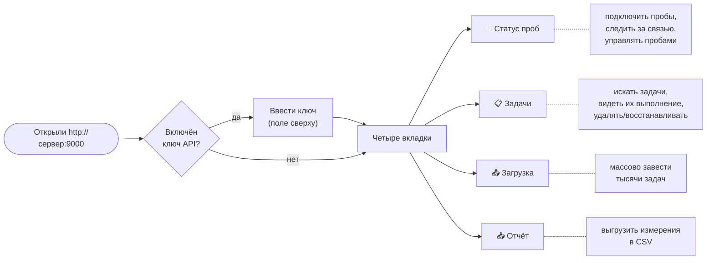
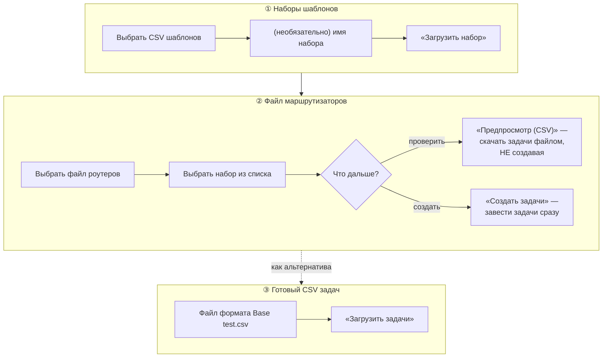

[← К обзору проекта (README)](../README.md) · [Вся документация](README.md)

---

## Веб-интерфейс оператора

Полное руководство: как пользоваться каждой вкладкой и функцией.

Интерфейс открывается по адресу сервера — **`http://сервер:9000/`** — и целиком помещается
на одной странице с четырьмя вкладками. Регистрация не нужна: если на сервере включён
**ключ API** (`Auth:ApiKey`), впишите его в поле **«Ключ API»** справа сверху — он сохраняется
в браузере и подставляется во все запросы. Пустое поле = аутентификация выключена.

**Живое обновление.** Вкладки «Статус проб» и «Задачи» обновляются сами, по событиям
сервера (длинный опрос `WaitChanges`): экран перерисовывается мгновенно при поступлении
результатов, смене статуса проб или изменении задач, плюс страховочно раз в ~25 с. Ручного
«Обновить» обычно не требуется. При скрытом окне браузера соединение не держится.

Все кнопки на время запроса показывают индикатор ожидания «⏳». Внизу каждого блока —
строка состояния с результатом последней операции или текстом ошибки.

---

### Вкладка «Статус проб» — подключение и управление пробами

Главная вкладка: здесь пробы подключают, следят за их связью и управляют ими. Состоит
из трёх блоков (сверху вниз): **список подтверждённых проб**, раскрывающаяся **таблица
задач выбранной пробы** и **список неопознанных проб** с полем подключения.

**Как подключить новую пробу (3 шага):**

1. В нижнем блоке **«Неопознанные пробы»** впишите адрес пробы в поле `http://адрес-пробы:8443` и нажмите **«Опросить пробу (CheckIn)»**. Сервер обратится к пробе, и та ответит своим «паспортом» (имя хоста, IP, MAC, версия) — появится строкой в списке неопознанных.
2. В строке неопознанной пробы нажмите **«Подтвердить»** — проба переедет в верхний список, сервер запустит её опрос и сразу дошлёт ей все её задачи (если они уже заведены).
3. Всё. Дальше проба работает сама; создавайте задачи — она их получит.

Кнопка **«Отклонить»** в строке неопознанной пробы убирает её из очереди (например, если
адрес ошибочный). Пустые/битые записи без адреса тоже отклоняются этой кнопкой.

Над списком проб — **фильтр** (по адресу / имени / хосту / версии и по состоянию
связи) и счётчик «показано N из всего». Сам список **скроллится внутри карточки**
(ограничен по высоте), поэтому сотни подключённых проб не растягивают страницу и
любую пробу легко найти набором части адреса или имени. Фильтрация мгновенная —
происходит в браузере, без обращения к серверу.

**Верхний список подтверждённых проб** — по колонкам:

| Колонка | Что показывает |
|---|---|
| Проба | адрес пробы (`RequestInfo`) — её уникальный ключ |
| Имя | отображаемое имя (задаётся кнопкой «имя») |
| Хост | имя хоста пробы из её паспорта |
| Версия | версия сборки пробы (`1.2.0`, `1.2.0-go`…) — видно отставшие после обновления |
| Связь | **в порядке** (зелёным) или **нет связи** (красным) — проба недоступна, идёт backoff |
| Последний ответ | момент последнего успешного опроса |
| Ошибка | текст последней ошибки связи |
| Задач | сколько активных задач у пробы (и сколько удалённых) |
| Результатов | сколько результатов получено с момента старта сервера |

Кнопки в строке каждой пробы:

- **«задачи»** — раскрывает под списком таблицу «Выполнение задач на пробе» (см. ниже);
- **«имя»** — переименовать пробу (диалог ввода нового имени);
- **«удалить»** — удалить пробу. Сначала спросит подтверждение, затем **отдельно** спросит, удалять ли **все её задачи**. Опрос пробы немедленно останавливается; далее срабатывает [авто-очистка](architecture.md#автоматическая-очистка-при-удалении-пробы).

**Таблица «Выполнение задач на пробе»** (по кнопке «задачи») — это живой статус *со стороны
пробы*, отвечающий на вопрос «а запустились ли задачи?», не дожидаясь первых результатов.
Есть свои фильтры (название, исход) и пагинация — задач может быть более 10 000. Колонки:
режим, **состояние** (выполняется / успех / ошибка приложения / убито по таймауту /
не запустилась / не запускалась), последний старт и завершение, счётчик «успехов / ошибок»,
следующий запланированный запуск, краткий результат.

---

### Вкладка «Задачи» — поиск, контроль выполнения и управление

Показывает все задачи с **серверной пагинацией** (выдерживает десятки тысяч задач) и
**фильтрами по всем столбцам**. Задачи здесь не создают поштучно — их заводят массово
на вкладке «Загрузка» (или через [HTTP API](http-api.md#http-api)); эта вкладка нужна, чтобы их
**находить, наблюдать за выполнением и удалять/восстанавливать**.

**Панель фильтров** (верхний ряд) — все условия комбинируются:

| Фильтр | Что отбирает |
|---|---|
| Название / Проба / Узел / Текст ошибки | подстрока (содержит, без учёта регистра) |
| Тип | Scheduler (по расписанию) или Repeater (разовая) |
| Режим | WinPing / TWamp / TWampy |
| Статус | активные / удалённые / все |
| Выполнение | успех / ошибка приложения / убито по таймауту / не запустилась / нет данных |

Нажмите **«Применить фильтр»** — список перестроится с первой страницы. Стрелки **←/→**
листают страницы, между ними — счётчик «N–M из всего».

**Колонки таблицы:** название, проба, узел, тип, режим, cron, дата окончания, таймаут,
**Статус** (активна/удалена) и два независимых статуса последнего запуска:

- **Выполнение** — как отработал *процесс*: выполнена / ошибка, и когда;
- **Результат** — что вернуло *приложение*: успех (код 0) или ошибка с кодом выхода и текстом (наведите курсор — увидите полный текст).

Разделение на два статуса важно: зонд может корректно запуститься и завершиться (Выполнение
= успех), но сама утилита вернуть ошибку измерения (Результат = ошибка код N). После
перезапуска сервера эти статусы восстанавливаются из БД — история не пропадает.

**Управление задачами:**

- в строке активной задачи — кнопка **«удалить»** (с подтверждением); у удалённой — **«восстановить»**;
- **массовые операции над всем отфильтрованным списком** (не только видимой страницей): **«Удалить отфильтрованное»** и **«Восстановить отфильтрованное»**. Кнопки появляются, только когда есть над чем работать, и показывают, сколько задач попадёт под операцию. Удобно, например, отфильтровать по пробе и снять все её задачи одним нажатием.

---

### Вкладка «Загрузка» — массовое создание задач

Три блока, пронумерованные по порядку работы. Массовая заливка устроена как
«**шаблоны × маршрутизаторы**»: набор шаблонов задаёт *что и как* мерить, файл
маршрутизаторов — *куда* (цели). На пересечении рождаются задачи «устройство × шаблон».

**① Наборы шаблонов.** Загрузите CSV шаблонов (формат — в [Форматах файлов](file-formats.md#форматы-файлов)).
Каждый файл образует именованный **набор** (имя по умолчанию — имя файла, можно задать своё).
Наборов может быть сколько угодно; ниже — таблица загруженных наборов с числом шаблонов.
В строке набора: кнопка **«показать»** раскрывает панель с **составом набора** — все его
шаблоны по колонкам (шаблон, проба, режим, тип, строка `Request`, cron, повторы/циклы/пауза,
начало, окончание, таймаут); кнопка **«удалить»** удаляет набор. Повторная загрузка набора
с тем же именем обновляет его.

**② Файл маршрутизаторов.** Выберите файл со списком узлов (выгрузка из инвентаризации),
затем в выпадающем списке — **набор шаблонов** для наложения (или все сразу). Две кнопки:

- **«Предпросмотр (CSV)»** — *ничего не создаёт*, а отдаёт готовый CSV задач для проверки. Его можно открыть глазами и потом залить блоком ③.
- **«Создать задачи»** — сразу заводит задачи (маршрутизаторы × шаблоны) и рассылает их пробам. В ответе — сколько маршрутизаторов, шаблонов, создано задач и какие строки не распознаны.

Идентификаторы задач **детерминированы**: повторная заливка того же файла обновляет
задачи, а не плодит дубликаты.

**③ Готовый CSV задач.** Если у вас уже есть CSV в формате «Base test.csv» (тот самый,
что отдаёт предпросмотр) — залейте его напрямую. В ответе вернутся названия задач с
некорректной датой окончания, если такие были.

---

### Вкладка «Отчёт» — выгрузка результатов

Выгрузка измерений в CSV за период. Задайте даты **«С … по …»** (если не заданы — последние
14 дней) и нажмите **«Скачать CSV»**. Выгрузка потоковая: период любой глубины не загружает
сервер в память. Состав колонок — в [Форматах файлов](file-formats.md#4-отчёт-выгрузка-downloadfile).

В колонку `CallLine` попадает фактическая строка вызова зонда (например `ping 10.0.5.11 -n 1`) —
по ней ответ однозначно опознаётся даже после изменения задачи. В колонку `Errors` — **все**
ошибки: stderr процесса, прерывание по таймауту, ненулевой код выхода, невозможность запустить зонд.

---

### Типовые сценарии

| Задача оператора | Что сделать |
|---|---|
| **Подключить новую пробу** | «Статус проб» → вписать адрес → «Опросить пробу» → «Подтвердить» |
| **Завести тысячи задач** | «Загрузка» → залить набор шаблонов → выбрать файл роутеров и набор → «Создать задачи» |
| **Проверить, что задачи пошли** | «Статус проб» → кнопка «задачи» у пробы (живой статус выполнения) |
| **Найти все проблемные задачи** | «Задачи» → фильтр «Выполнение = ошибка приложения» (или «убито по таймауту») → «Применить» |
| **Снять все задачи с пробы** | «Задачи» → фильтр по пробе → «Удалить отфильтрованное»; либо «Статус проб» → «удалить» с удалением задач |
| **Переименовать пробу** | «Статус проб» → кнопка «имя» |
| **Выгрузить измерения за месяц** | «Отчёт» → задать даты → «Скачать CSV» |

Для интеграций и автоматизации те же операции доступны через [HTTP API](http-api.md#http-api);
Swagger — по `/swagger` на обоих приложениях (кнопка **Authorize** для ключа API).

---

---

[← К обзору проекта (README)](../README.md) · [Вся документация](README.md)

---
